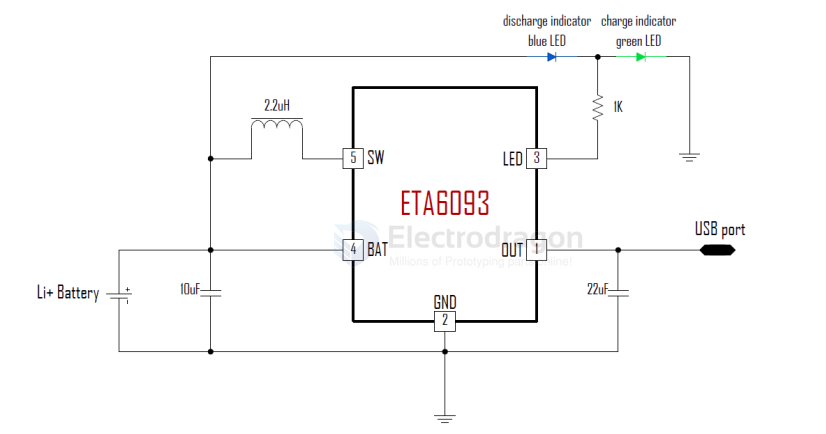

# ETA-solutions-dat

- [[battery-charger-dat]] - [[ETA-solutions-dat]]

ETA6093 - 1.2A Switching Charger and 1.2A Boost in One Sot23-5 with Single Inductor

ETA6093 is a switching Li-Ion battery charger capable of delivering up to 1.2A of charging current to the battery and also capable of delivering up to 5V/1.2A in boost operation, with high efficiency in both charging mode and boost mode. For charging, it uses a proprietary control scheme that eliminates the current sense resistor for conventional constant current control, maximizing efficiency, reducing charging time and reducing costs. It can also output a 5V voltage in the reversed direction by boosting from the battery. It only needs a single inductor to provide power bi-directionally with a proprietary automatic mode detect and switch scheme. ETA6093 is an ideal all-in-one solution for battery charging and discharge applications, such as power banks, smart phones, and tablets with only one USB port that can be used for charging battery function.

ETA6093 is suitable for charging a 4.2V Li-ion battery. And ETA6093 is in SOT23-5 package.

FEATURES

-  Bi-Directional Power conversion with Single Inductor
-  Automatic Mode Switching
-  Switching Charger
-  5V Synchronous Boost
-  Up to 95% Efficiency
-  Up to 1.2A Max charging current and 1.2A discharging
-  No-Battery detection
-  No External Sense resistor

APPLICATIONS
-  Tablet, MID
-  Smart Phone
-  Power Bank