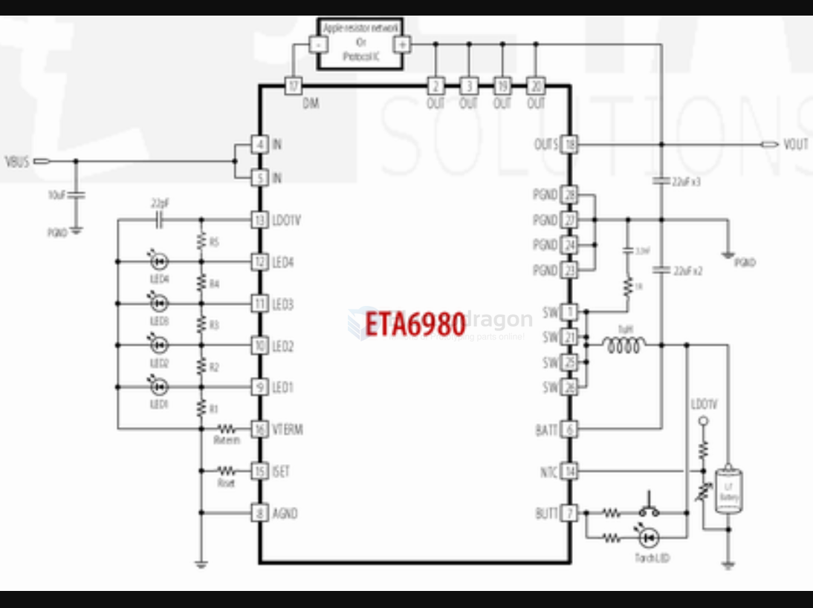

# ETA6980-dat

- [[insta360-go2-dat]] - [[insta360-dat]]

- [[ETA6980-dat]] - [[ETA-solutions-dat]]

ETA6980是5V-2.4A充放电的移动电源芯片，自动负载启动，内置20V耐压能力，能够抵抗各种浪涌冲击，可用于移动电源，自带4个LED精准电量灯（电量可调），采用了QFN4X4-28封装。

## ref 

