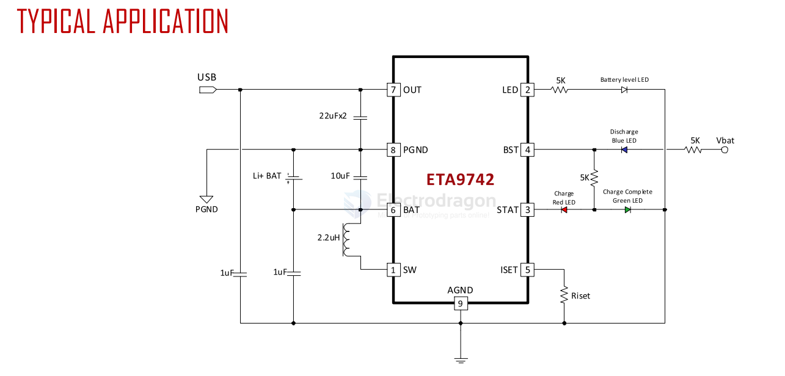
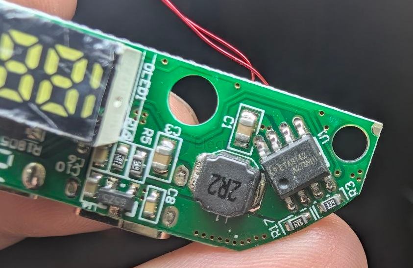
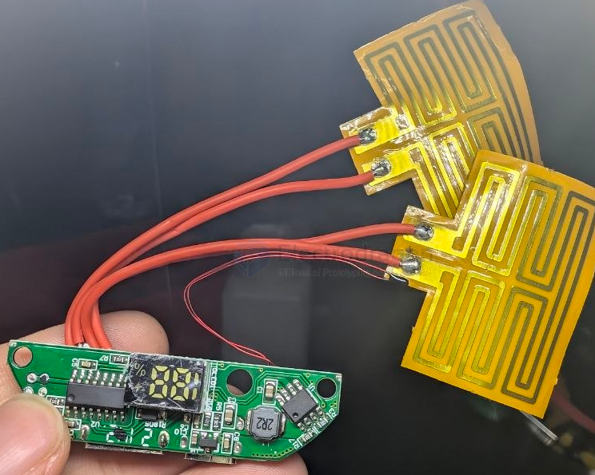
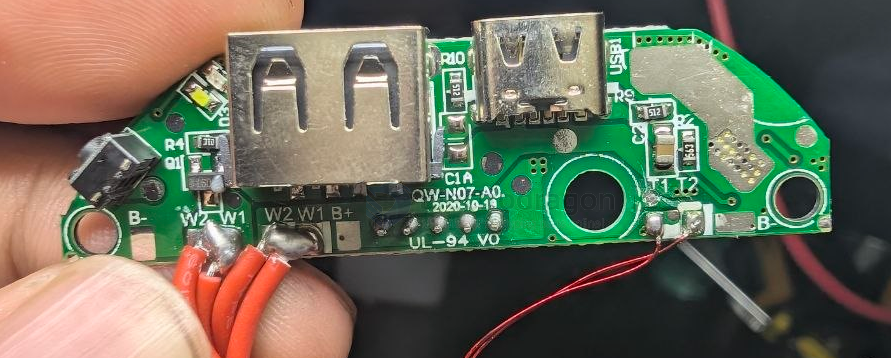

# ETA9742-dat

- [[battery-charger-1s-dat]] - [[ETA9741-dat]] - [[battery-1s-dat]] - [[ETA9742-dat]]

3A Switching Charger, 2.4A Boost and 3 LED-indicators for battery level, charge/discharge status in One ESOP8 with Single Inductor 

ETA9742 is a switching Li-Ion battery charger capable of delivering up to 3A of charging current to the battery and also capable of delivering up to 5V/2.4A in boost operation, with high efficiency in both charging mode and boost mode. It also includes a fuel gauge system for power indication. For charging, it uses a proprietary control scheme that eliminates the current sense resistor for conventional constant current control, maximizing efficiency, reducing charging time and reducing costs. It can also output a 5V voltage in the reversed direction by boosting from the battery. It only needs a single inductor to provide power bidirectionally with a proprietary automatic mode detect and switch scheme. ETA9742 is an ideal all-in-one solutionfor battery charging and discharge applications, such as power banks, smart phones, and tablets with only one USB port that can be used for charging battery function.

ETA9742 is suitable for charging a 4.2V Li-ion battery. And ETA9742 is inESOP8 package

## build 

## ref 

