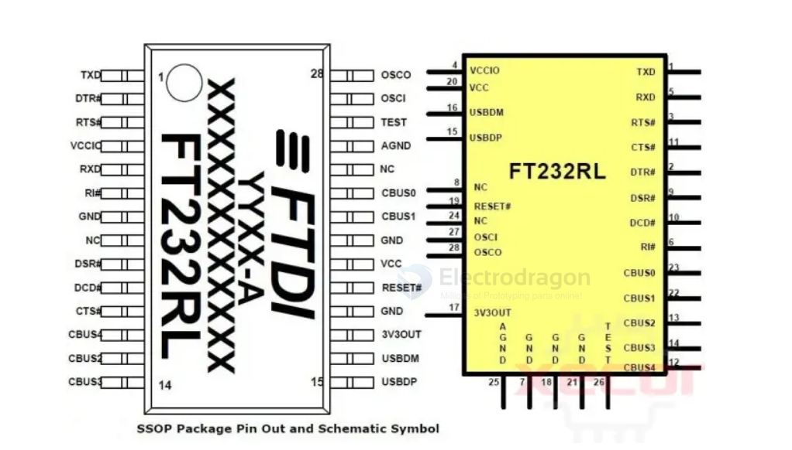
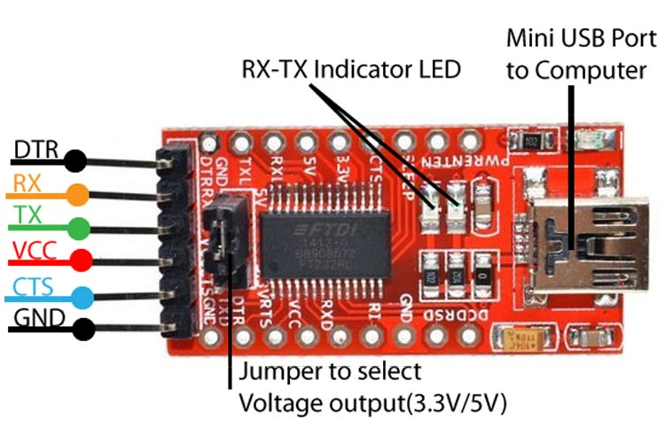

# FT232-dat 

FT232R Specifications

FTDI's FT232R technical specifications, attributes, parameters, and parts with similar specifications to FTDI's [FT232RQ-REEL.](https://www.xecor.com/product/ft232rq-reel)

| Type                     | Parameter                        |
| ------------------------ | -------------------------------- |
| Function                 | Bridge, USB to UART              |
| Interface                | UART                             |
| Standard                 | USB 2.0                          |
| Speed                    | High Speed (HS), Full Speed (FS) |
| Data Rate                | 12 Mb/s                          |
| Voltage - Supply         | 3.3V ~ 5.25V                     |
| Operating Supply Current | 25 mA                            |
| Mounting Style           | SMD/SMT                          |
| Operating Temperature    | -40°C ~ 85°C                     |
| Package / Case           | QFN-EP-32                        |

## Chip Pinout 

## Pin Maps 

## ref 

- driver - https://ftdichip.com/drivers/
- [[CDM-v2.12.36.4.U-WHQL-Certified.zip]]

- [[FT232]]