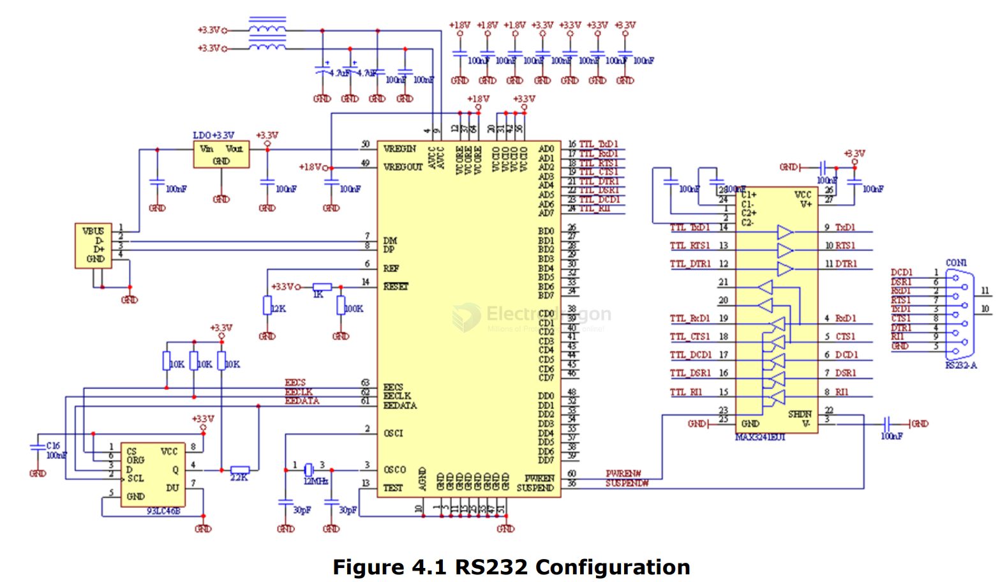

# FT4232-dat

FT4232H == Quad High-Speed USB to MultiPurpose UART/MPSSE IC

datasheet == [[DS_FT4232H.pdf]]

## diagram and SCH 

- [[RS232-dat]] - [[RS422-dat]]

- [[MAX3241-dat]] - [[analog-device-dat]]

## ref 

- [[FTDI-dat]]