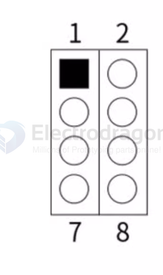
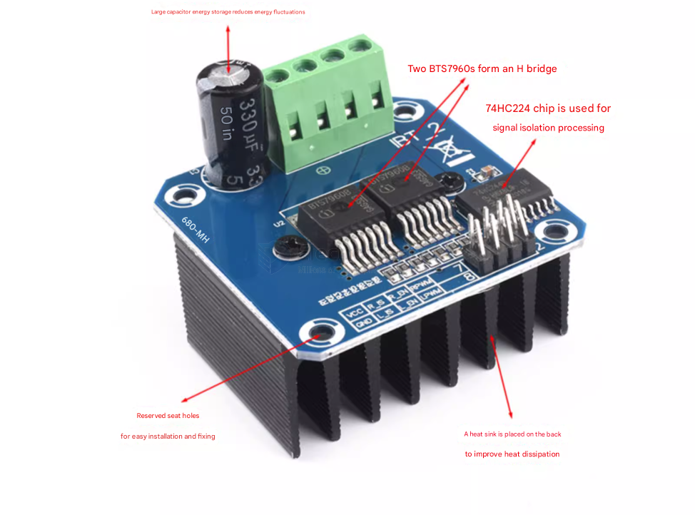
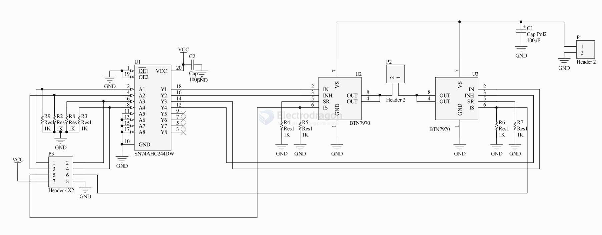
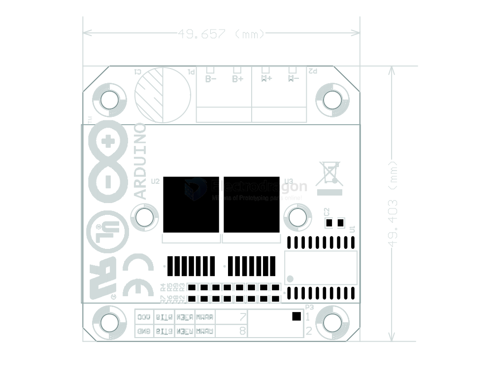

# BTS7960-dat

This driver uses Infineon's high-power driver chip BTS7960 to form an H-bridge driver module, featuring over-temperature and over-current protection. The dual BTS7960 H-bridge driver circuit provides strong driving and braking capabilities. It uses a 74HC244 chip to effectively isolate the microcontroller from the motor driver! High current 43A!

Product Features:
- 1. Dual BTS7960 high current (43A) H-bridge driver
- 2. 5V isolation from the microcontroller, effectively protecting the microcontroller
- 3. Capable of motor forward and reverse rotation, two PWM inputs up to 25kHz frequency
- 4. Two channels for over-current and over-temperature error signal output;
- 5. Isolated chip 5V power supply (can share 5V with the microcontroller);
- 6. Power supply voltage 5.5V to 27V;

- Model: EDIBT-2
- Input Voltage: 6V~27V
- Maximum Current: 43A
- Input Level: 3.3V~5V
- Control Method: PWM or Level
- Duty Cycle: 0~100%
- Current Sense Output: Yes

- 1. R_PWM: Forward rotation level or PWM signal input, high level active
- 2. L_PWM: Reverse rotation level or PWM signal input, high level active
- 3. R_EN: Forward rotation driver enable input, high level enable, low level disable
- 4. L_EN: Reverse rotation driver enable input, high level enable, low level disable
- 5. R_IS: Forward rotation driver side current alarm output
- 6. L_IS: Reverse rotation driver side current alarm output
- 7. VCC: +5V power input, connects to microcontroller 5V power
- 8. GND: Signal common ground

## Usage Method:

Method 1:
- Connect VCC to the microcontroller's 5V power, connect GND to the microcontroller's GND.
- Short R_EN and L_EN together and connect to a 5V level; the driver can now operate.
- L_PWM: Input PWM signal or high level for motor forward rotation.
- R_PWM: Input PWM signal or high level for motor reverse rotation.

Method 2:
- Connect VCC to the microcontroller's 5V power, connect GND to the microcontroller's GND.
- Short R_EN and L_EN together and input a PWM signal for speed control.
- L_PWM: Input 5V level for motor forward rotation.
- R_PWM: Input 5V level for motor reverse rotation.

## SCH 

## Dimension 

