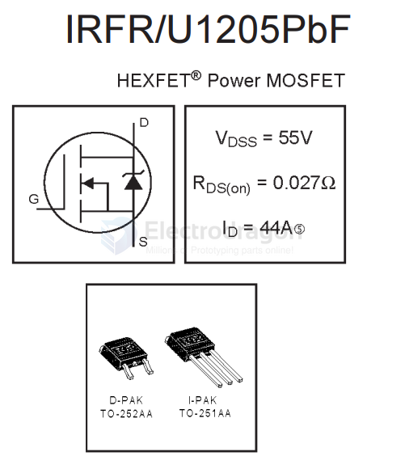

# IRFR1205-dat

## FR1205-dat

- [[mosfet-dat]]

- [[Infineon-IRFR1205-DataSheet-v01_01-EN.pdf]]

The FR1205 is an N-channel enhancement mode power MOSFET manufactured by Fortune Semiconductor (often under the brand Fortune or Fortune Semiconductor Corporation). It is commonly used in power switching applications due to its ability to handle relatively high voltages and currents with low on-resistance.

Key Specifications of FR1205:

- Type: N-Channel MOSFET
- Drain-Source Voltage (Vds): 55V
- Continuous Drain Current (Id): 33A (at 25°C)
- Rds(on) (Max): ~0.045Ω @ Vgs = 10V
- Gate Threshold Voltage (Vgs(th)): 2.0V - 4.0V
- Power Dissipation: ~110W
- Package: TO-220 or TO-252 (DPAK), depending on the version

Features:

- **Low Rds(on)**: Reduces conduction losses, improving efficiency.
- **High Current Handling**: Suitable for high-current loads like motor control or power supply outputs.
- **Fast Switching**: Good for use in high-frequency switching power supplies and converters.
- **Enhanced ESD protection** (depending on version).

Common Applications:

- DC-DC converters
- Power management in computers and portable devices
- Motor drivers
- Load switches
- General-purpose switching

## ref 

- [[infineon-dat]]