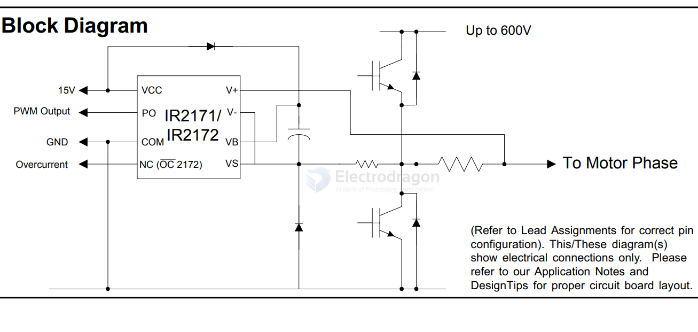

# IR2171-dat

- [[IR2171-dat]] - [[infineon-dat]] - [[sensor-current-dat]]

For new designs we recommend IR's new products IR2175, IR2177, IR21771, IR2277 or IR22771.

LINEAR CURRENT SENSING IC

https://www.infineon.com/assets/row/public/documents/non-assigned/49/infineon-ir2172s-ds-en.pdf

Features
- • Floating channel up to +600V
- • Monolithic integration
- • Linear current feedback through shunt resistor
- • Direct digital PWM output for easy interface
- • Low IQBS allows the boot strap power supply
- • Independent fast overcurrent trip signal
- • High common mode noise immunity
- • Input overvoltage protection for IGBT short circuit condition
- • Open Drain outputs

Description

IR2171/IR2172 are monolithic current sensing IC designed for motor drive applications. It senses the motor phase current through an external shunt resistor, converts from analog to digital signal, and transfers the signal to the low side. 

IR’s proprietary high voltage isolation technology is implemented to enable the high bandwidth signal processing. 

The output format is discrete PWM to eliminate need for the A/D input interface for the IR2172. The dedicated overcurrent trip (OC) signal facilitates IGBT short circuit protection. 

The opendrain outputs make easy for any interface from 3.3V to 15V

## SCH 

## ref 