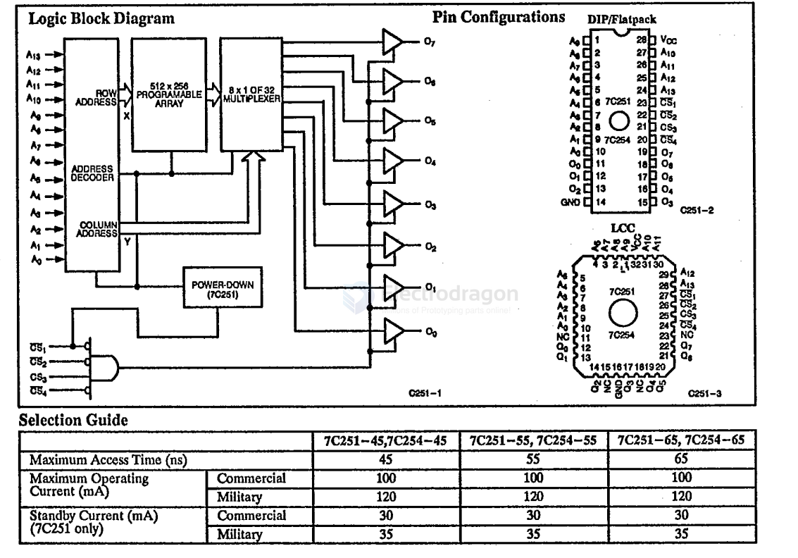
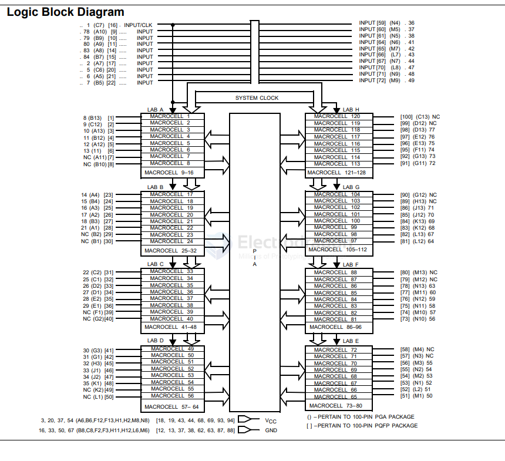

# cypress-dat

- [[cypress-dat]] - [[infineon-dat]] - [[RAM-dat]]

- [[cypress-dat]] - [[Infineon-dat]] - [[pins003-dat]] - [[MCU-dat]]

- [[app-dat]] - [[logic-analyzer-dat]] - [[USB-blaster-dat]] - [[data-acquisition-board-dat]]

- [[CY7C68013A-dat]] - [[cypress-dat]]

- [[PulseView-dat]] - [[logic-analyzer-dat]]

## CY7C251

Infineon CY7C251-45WMB Datasheet - CYPRESS SEMICONDUCTOR

### Features

- CMOS for optimum speed/power
- Windowed for reprogrammability
- High speed: 45 ns
- Low power: 550 mW (commercial), 660 mW (military)
- Super low standby power (7C251): less than 165 mW when deselected
- Fast access: 50 ns
- EPROM technology, 100% programmable
- Slim 300-mil or standard 600-mil packaging available
- 5V ±10% VCC, commercial and military
- TTL-compatible I/O
- 16,384 x 8 PROM, power switched and reprogrammable
- Direct replacement for bipolar PROMs
- Capable of withstanding >2001V static discharge

### Functional Description

The CY7C251 and CY7C254 are high-performance 16,384-word by 8-bit CMOS PROMs. When deselected, the CY7C251 automatically powers down into a low-power stand-by mode. It is packaged in a 300-mil-wide package. The 7C254 is packaged in a 600-mil-wide package and does not power down when deselected.

The 7C251 and 7C254 are available in reprogrammable packages equipped with an erasure window; when exposed to UV light, these PROMs are erased and can then be reprogrammed. The memory cells utilize proven EPROM floating gate technology and byte-wide intelligent programming algorithms.

The CY7C251 and CY7C254 are plug-in replacements for bipolar devices and offer the advantages of lower power, superior performance, and high programming yield. The EPROM cell requires only 12.5V for the super voltage, and low current requirements allow for gang programming. The EPROM cells allow each memory location to be tested 100% because each location is written into, erased, and repeatedly exercised prior to encapsulation.

Each PROM is also tested for AC performance to guarantee that after customer programming, the product will meet DC and AC specification limits.

Reading is accomplished by placing all four chip selects in their active states. The contents of the memory location addressed by the address lines (A0 - A13) will become available on the output lines (O0 - O7).

### Logic Block Diagram

## CY7C346

Infineon CY7C346-35RMB

Features
• 128 macrocells in eight logic array blocks (LABs)
• 20 dedicated inputs, up to 64 bidirectional I/O pins
• Programmable interconnect array
• 0.8-micron double-metal CMOS EPROM technology
• Available in 84-pin CLCC, PLCC, and 100-pin PGA, PQFP

Functional Description
The CY7C346 is an Erasable Programmable Logic Device
(EPLD) in which CMOS EPROM cells are used to configure
logic functions within the device. The MAX® architecture is
100% user-configurable, allowing the device to accommodate
a variety of independent logic functions

The 128 macrocells in the CY7C346 are divided into eight
LABs, 16 per LAB. There are 256 expander product terms, 32
per LAB, to be used and shared by the macrocells within each
LAB.
Each LAB is interconnected through the programmable inter-
connect array, allowing all signals to be routed throughout the
chip.
The speed and density of the CY7C346 allow it to be used in
a wide range of applications, from replacement of large
amounts of 7400-series TTL logic, to complex controllers and
multifunction chips. With greater than 25 times the functionality
of 20-pin PLDs, the CY7C346 allows the replacement of over
50 TTL devices. By replacing large amounts of logic, the
CY7C346 reduces board space, part count, and increases
system reliability.

## RAM 

## ref