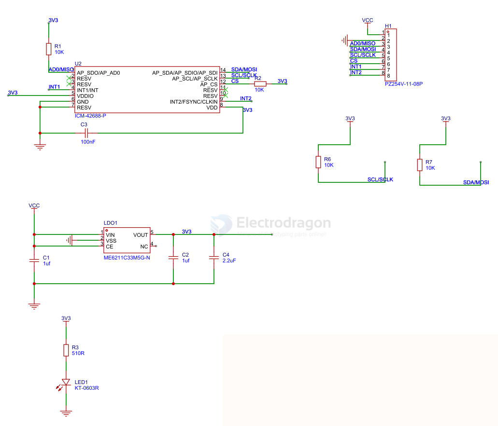

# ICM42688-dat

- [[BM1270-dat]] - [[BM160-dat]] - [[MPU6050-dat]] - [[ICM20602-dat]] - [[ICM42688-dat]]

- [[sensor-motion-dat]] - [[6-axis-dat]]

`I428P` is the top-side silk screen marking (or part marking) for the ICM-42688-P, a high-performance 6-axis MEMS motion tracking sensor manufactured by TDK InvenSense. 

Key SpecificationsSensor 

Type: 6-axis inertial measurement unit (IMU) featuring a 3-axis **gyroscope** and a 3-axis **accelerometer**.

Package / Footprint: LGA-14 / QFN-14 surface-mount package (compact 2.5 mm x 3 mm x 0.91 mm size).

Common Applications: Wearables, robotics, drones, and high-precision motion-sensing electronics.

Identification: The code I428P (sometimes accompanied by date codes or lot numbers like 1428P) is printed directly on the package face for factory identification. 

The ICM42688-P six-axis `attitude` sensor module boasts superior performance. According to the official datasheet, its performance surpasses that of the `BM1270` and far exceeds products like the BMI160, MPU6050, and ICM20602. It features low temperature drift, low bias, and supports LLC and SPI drivers.

This product supports both 5V and 3.3V power supply via VCC.

Currently, ILC and SPI drivers for the STM32F103 are available for order. STM32 drivers and official driver source code are provided.

For inertial navigation using this MEMS sensor, the official claim is 5% accuracy (5m error per 100m, depending on the application scenario and algorithm). A product with direct attitude information output from the IMU will be released later; stay tuned!

## SCH 

## ref 

- [[6-axis-dat]]