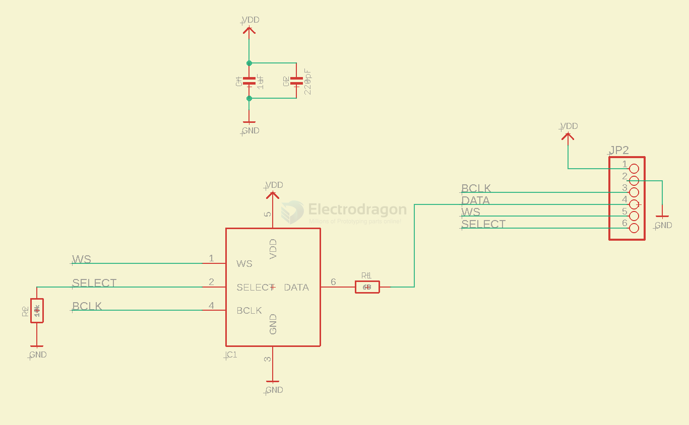
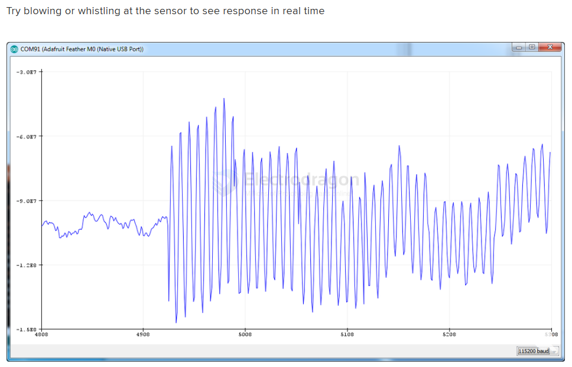

# ICS-43434-dat

https://invensense.tdk.com/products/ics-43434/

https://invensense.tdk.com/wp-content/uploads/2016/02/DS-000069-ICS-43434-v1.2.pdf

Multi-Mode	Microphone	with	I2S	Digital	Output

## SCH

## code: 

InputPlotter demo but this code is higher resolution:

- arduino code [[ICS-43434-arduino.ino]]
- ESP32 code - [[ICS-43434-esp32.ino]]

output arduino: 

## ref 

- [[TDK-dat]]