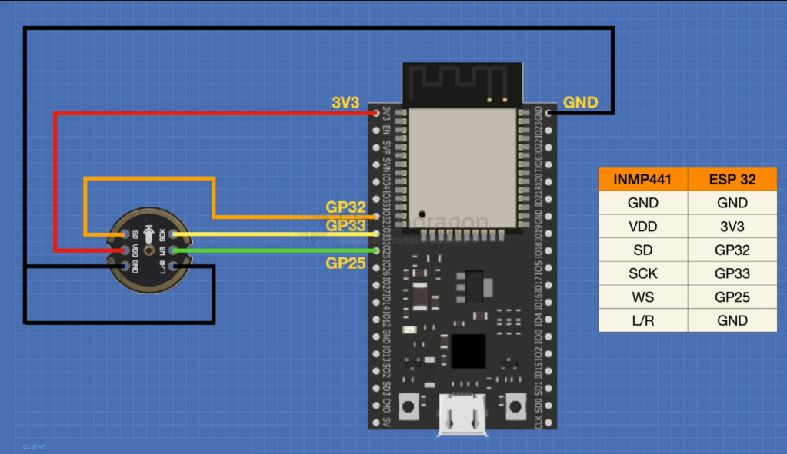

# INMP441-dat

datasheet == https://invensense.tdk.com/wp-content/uploads/2015/02/INMP441.pdf

## Pins 

- L/R
- WS
- SD
- SCK

- SCK: I²S serial data clock
- WS: I²S serial word select
- L/R: Left/Right channel select
  - When set to LOW, the microphone outputs signal on the left channel of the I²S frame.
  - When set to HIGH, the microphone outputs signal on the right channel.
- SD: I²S serial data output
- VCC: Power input, 1.8V to 3.3V
- GND: Ground

## wiring to ESP32 

INMP441 to ESP32

- SCK >> GPIO14
- SD >> GPIO32
- WS >> GPIO15
- L/R >> GND
- GND >> GND
- VDD >> VDD3.3

## code 

- [[INMP441-code.ino]] - [[INMP441-code2.ino]]

## ref 

- [[I2S-dat]]
