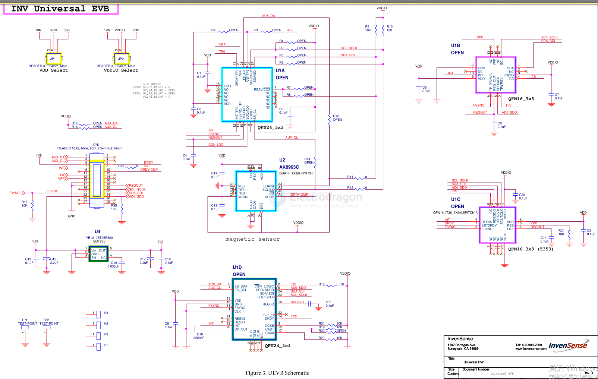
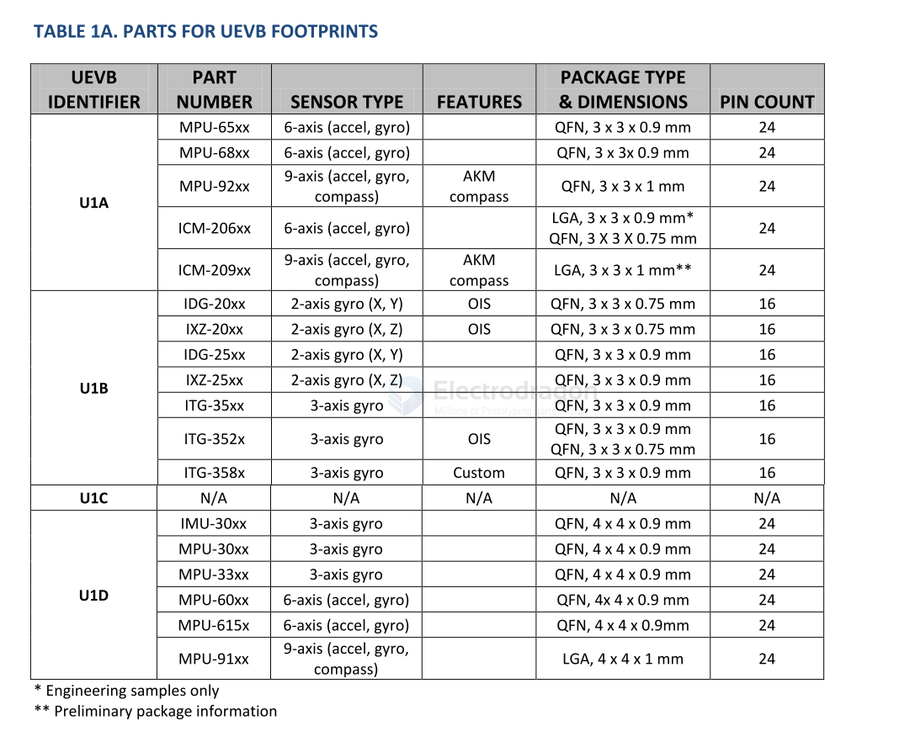

# invensense-EVM-dat

EVM board SCH - [[AN-IVS-0001EVB-00.pdf]]

PART NUMBER

U1A
- MPU-65xx
- MPU-68xx
- MPU-92xx
- ICM-206xx
- ICM-209xx

U1B
- IDG-20xx
- IXZ-20xx
- IDG-25xx
- IXZ-25xx
- ITG-35xx
- ITG-352x
- ITG-358x

U1C
N/A

U1D
- IMU-30xx
- MPU-30xx
- MPU-33xx
- MPU-60xx
- MPU-615x
- MPU-91xx

## ref 

- [[invensen-dat]]