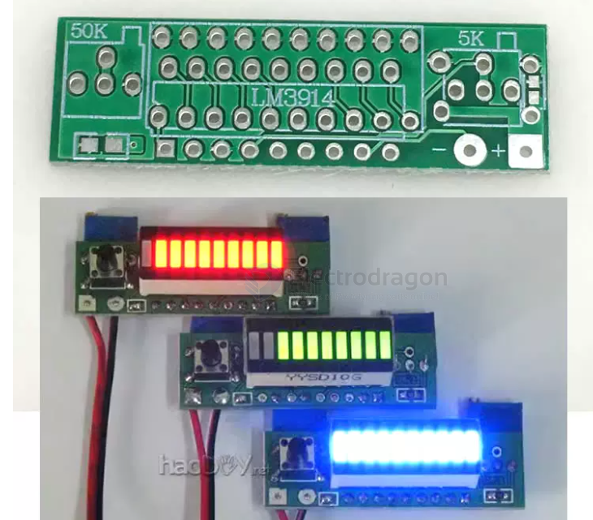

# LM3914-dat

- [[LMxx-dat]] - [[LM3914-dat]]

LM3914是美国国家半导体公司的点状/条状显示驱动器，已经面市20多年了，LM3914可以精确的检测模拟电压，并使10个LED显示，显示方式点状模式点亮10个LED中的一个，或以条形模式逐个点亮LEDLM3914制作的电池电量显示，简单易懂，一目了然，让你随时知晓和掌控

显示方式说明：显示电池上下限之间电压，分10档显示，每一灯亮代表电量显示的10%，10灯代表显示电量0%-100%范围，使电池的剩余电量一目了然；还可以改成单灯显示，就是显示只有一盏灯亮，更省电，单灯亮耗电4mA，全亮42mA

## ref 