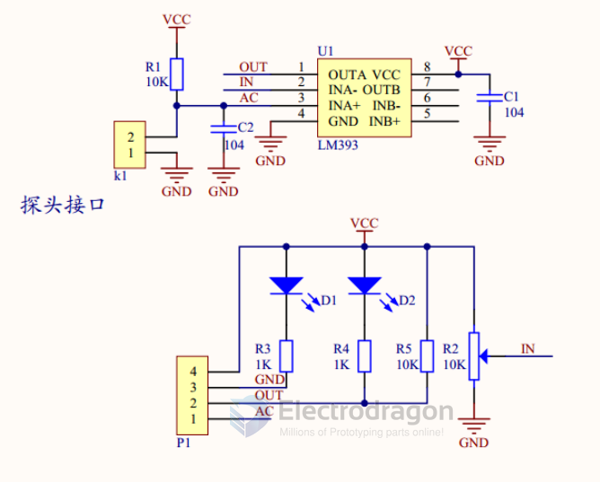

# LM393-dat

## analog sensor input 

- [[comparator-dat]]

## common tuning methods for LM393

- The sensor is suitable for soil moisture measurement.
- The blue potentiometer on the module adjusts the moisture threshold. Turn clockwise to raise the threshold (requiring wetter soil to trigger), and counter-clockwise to lower it.
- The digital output D0 can be connected directly to a microcontroller. Read D0 as a logic level (HIGH/LOW) to detect soil moisture state.

## ref 

- [[SMO1052-dat]]