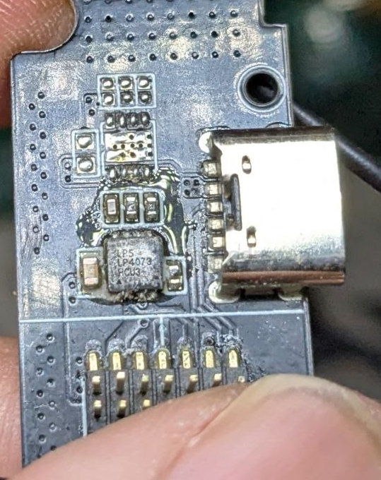

# LP4073-dat

- [[LP4073-dat]] - [[lowpowersemi-dat]]

1A Single Chip Li-Ion and Li-Polymer Charger

The LP4073 is a complete constant-current/ constant voltage linear charger for single cell lithium-ion battery. No external sense resistor is needed, and no blocking diode is required due to the internal MOSFET architecture. Thermal feedback regulates the charge current to limit the die temperature during high power operation or high ambient temperature. The charge voltage is fixed at 4.2V/4.35V, and the charge current can be programmed externally by ISET pin with a single resistor.

The LP4073 automatically terminates the charge cycle when the charge current drops to 1/10 setting current value after the final float voltage is reached. Other features include charge current monitor, under voltage lockout, automatic recharge, status pins and battery temperature detection

Features
- Input Voltage up to 28V
- Input Over Voltage Protection：7V
- Short-circuit protection
- Programmable Charge Current up to 1A
- 1µA Battery Reverse Current
- Over temperature Sensing Protection
- Protection of Reverse Connection of Battery
- Constant-Current/Constant-Voltage Operation with Thermal Regulation
- TDFN-8 Package
- RoHS Compliant and 100% Lead (Pb)-Free

