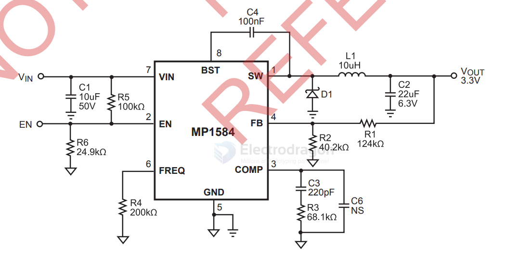

# MP1584-DAT

- [[OPM1104-dat]]

- [[OPM1006-dat]]

- [[OPM1152-dat]] - [[OPM1153-dat]]

## chip info 

3A, 1.5MHz, 28V Step-Down Converter

- https://www.monolithicpower.com/en/documentview/productdocument/index/version/2/document_type/Datasheet/lang/en/sku/MP1584EN-LF-Z/document_id/204/

FB = pin 4 

- [[resistor-dat]] - [[resistor-feedback-dat]]

Feedback Voltage = 0.8V 

## ref 

- [[mp1584]]