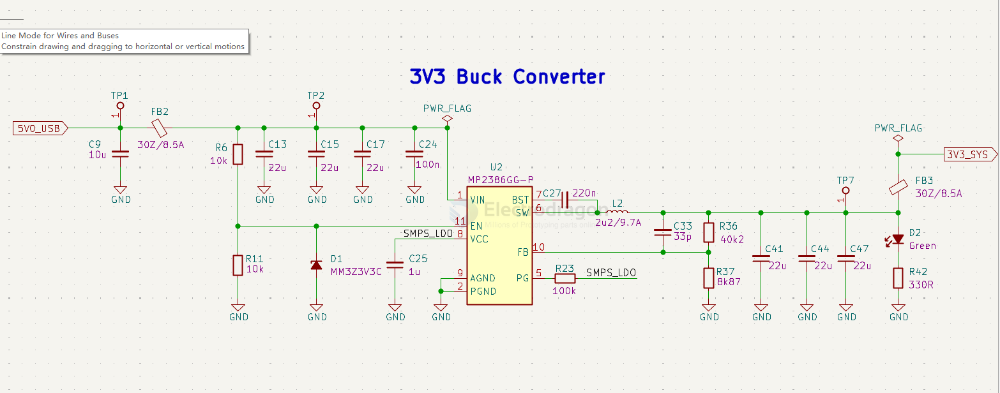

# MP2386-dat

- [[MP2386-dat]] - [[MPS-dat]] - [[dcdc-down-dat]] 

24V, 8A, Low IQ, Synchronous Buck Converter 

The MP2386 is a fully integrated, highfrequency, synchronous, rectified, step-down, switch-mode converter. The MP2386 offers a super-compact solution that achieves 8A of continuous output current over a wide input supply range. 

## SCH 

## ref 