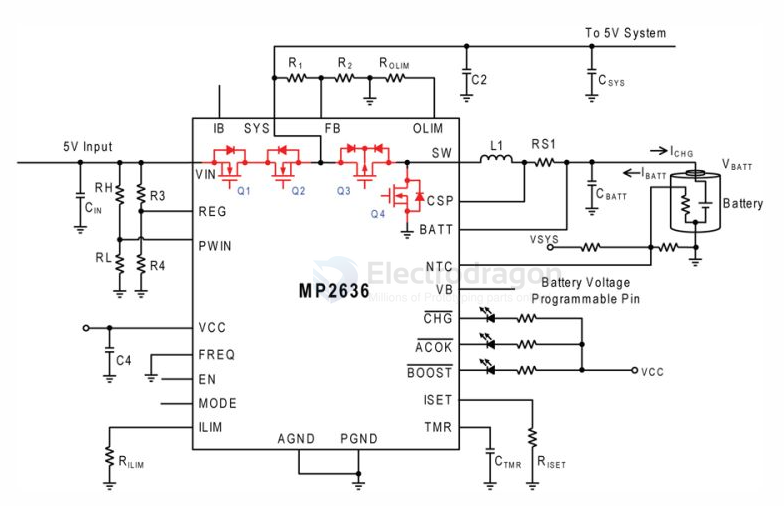

# MP2636-dat

MP2636 == 3.0A Single Cell Switch Mode Battery Charger with Power Path Management (PPM) and 3.0A System Boost Current

The MP2636 is a highly-integrated, flexible switch-mode battery charger with system power path management, designed for single-cell Li-ion or Li-Polymer batteries used in a wide range of portable applications. 

The MP2636 can operate in both charge mode and boost mode to allow full system management and battery power management. 

When input power is present, the device operates in charge mode. 

It automatically detects the battery voltage and charges the battery in three phases: trickle current, constant current and constant voltage. 

Other features include charge termination and auto-recharge. 

This device also integrates both input current limit and input voltage regulation in order to manage input power and meet the priority of the system power demand. 

In the absence of an input source, the MP2636 switches to boost mode through the MODE pin to power the SYS pins from the battery. 

The OLIM pin programs the output current limit in boost mode. 

The MP2636 also allows an output short circuit protection to completely disconnect the battery from the load in the event of a short circuit fault. 

Normal operation will recover as soon as the short circuit fault is removed. 

The MP2636 provides full operating status indication to distinguish charge mode from boost mode. In addition, the MP2636 can report the real battery current in both charge and boost mode via IB pin. 

The MP2636 achieves good EMI/EMC performance with well controlled switching edges. 

datasheet == https://www.monolithicpower.com/en/mp2636.html

