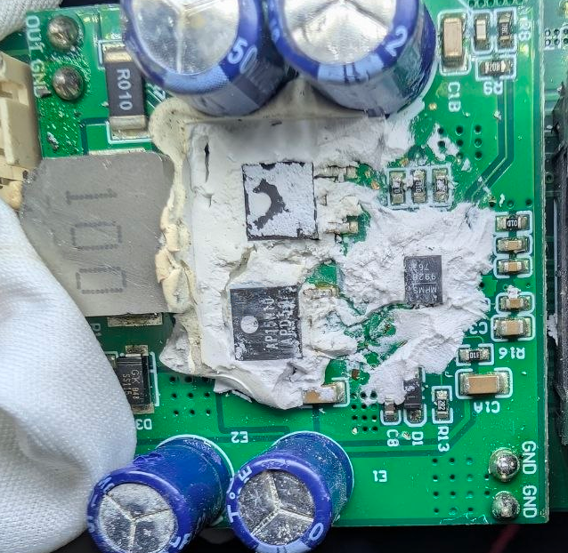

# MP9928-dat

- [[MPS-dat]] - [[MP9928-dat]] - [[dcdc-down-dat]] 

https://www.monolithicpower.com/en/documentview/productdocument/index/version/2/document_type/Datasheet/lang/en/sku/MP9928/document_id/193?srsltid=AfmBOoou_eAsGdeLJGBriyxz236ITj3vaRNPPw7poKrclT2BqaaFGAMO

The MP9928 is a high-voltage, synchronous step-down switching regulator controller that can directly step down voltages from up to 60V.

The MP9928 uses PWM current control architecture with accurate cycle-by-cycle current limiting. It is capable of driving dual Nchannel MOSFET switches. AAM Mode (Advanced asynchronous mode) enables non-synchronous operation and PFM mode to optimize light load efficiency.

The operating frequency of MP9928 can be programmed by an external resistor or synchronized to an external clock for noisesensitive applications. Fault protections are available including a precision output over voltage protection (OVP), output over current protection (OCP), and thermal shutdown.

The MP9928 is available in TSSOP20-EP package and QFN-20 (3mmx4mm) package.

## build 

- [[mosfet-dat]]

- [[PCB-stack-dat]] - [[PCB-form-dat]]

## ref 
