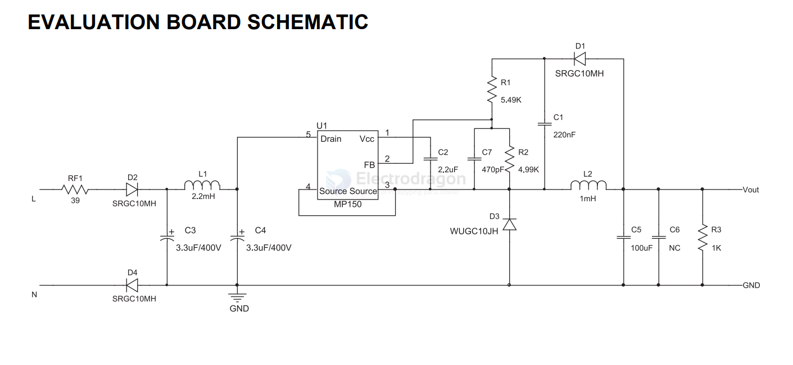

# MP150-dat 

* [5V reference design - EV150-J-00A](https://www.monolithicpower.cn/documentview/productdocument/index/version/2/document_type/Datasheet/lang/en/sku/EV150-J-00A/)
* [reference design 2](https://www.monolithicpower.com/en/documentview/productdocument/index/version/2/document_type/Application%20Note/lang/en/sku/MP150/document_id/16/)
* [datasheet](https://www.monolithicpower.com/en/documentview/productdocument/index/version/2/document_type/Datasheet/lang/en/sku/MP150/)

## EV150 EVM Board SCH 

- [[diode-dat]]

## ref 

- [[SVC1031-dat]]

- [[MP150]]