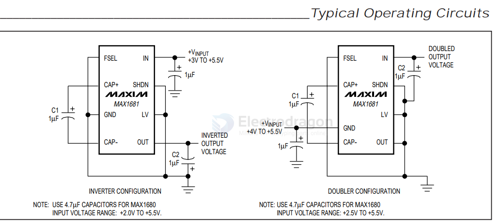

# MAX168x-dat

125mA, Frequency-Selectable, Switched-Capacitor Voltage Converters 

MAX1680/MAX1681

- [[MAX168x-dat]] - [[maxim-dat]]

https://www.analog.com/media/en/technical-documentation/data-sheets/max1680-max1681.pdf

The MAX1680/MAX1681 inductorless switched-capacitor voltage converters either invert an input voltage of +2.0V to +5.5V or double it while supplying up to 125mA output current. They have a selectable-frequency option that allows the use of small capacitors: 4.7µF (MAX1680), 1µF (MAX1681). With their high output current capability, these charge-pump devices are suitable replacements for inductor-based regulators, which require more expensive external components and additional board space.

The devices’ equivalent output resistance (typically 3.5Ω) allows them to deliver as much as 125mA with only a 440mV drop. A shutdown feature reduces quiescent current to less than 1µA. The MAX1680/MAX1681 are available in 8-pin SO packages. For devices that deliver up to 50mA in smaller µMAX packages, refer to the MAX860/MAX861 data sheet.

## SCH 

## Applications

- [[voltage-negative-dat]] - [[voltage-dat]] - [[MAX168x-dat]] - [[maxim-dat]]

- Local Negative Supplies
- Interface Power Supplies
- Op-Amp Power Supplies
- MOSFET Bias

## ref 

