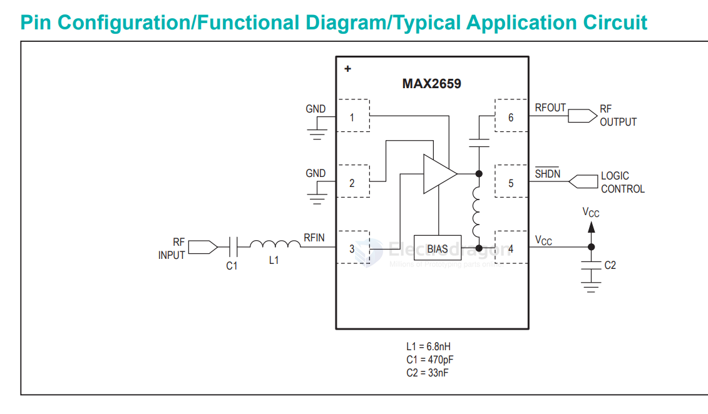

# MAX2659-dat

The MAX2659 is a high-gain, low-noise amplifier (LNA) designed for GPS, Galileo, and GLONASS applications. 

It offers a high gain of 20.5dB and a low noise figure of 0.8dB, which helps improve the sensitivity of GNSS receivers. 

It operates from a +1.6V to +3.3V single supply and has a low supply current. 

It also features an integrated 50Ω output matching circuit, simplifying the design.

- datasheet [[max2659]]

## APP 

## ref 

- [[LNA-dat]] - [[Maxim-dat]]