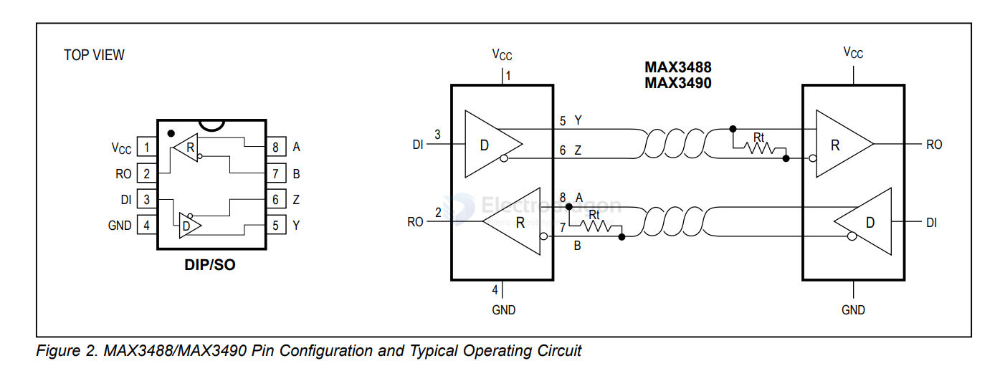

# MAX3490-dat

## Choosing Between MAX490 and MAX3490 for 3.3V Systems

### ✅ Use Case: 3.3V Power Supply

If your system uses a **3.3V power supply**, the **MAX3490** is the appropriate choice.

### 🔍 Comparison Table

| Feature         | MAX490              | MAX3490              |
|----------------|---------------------|----------------------|
| Supply Voltage | 5V (±10%)           | 3.3V (±10%)          |
| I/O Levels     | TTL/CMOS (5V logic) | 3.3V CMOS compatible |
| RS Standard    | RS-485/RS-422       | RS-485/RS-422        |
| ESD Protection | Basic               | Enhanced             |
| Application    | 5V Systems          | 3.3V Systems         |

### ✅ Recommendation

For 3.3V systems, use the **MAX3490**:
- Fully compatible with 3.3V logic levels
- Drop-in solution for RS-485/RS-422 communication
- Low-power and ESD-protected

## ref 

- [[MAX490-dat]] - [[maxim-dat]] - [[analog-device-dat]]

