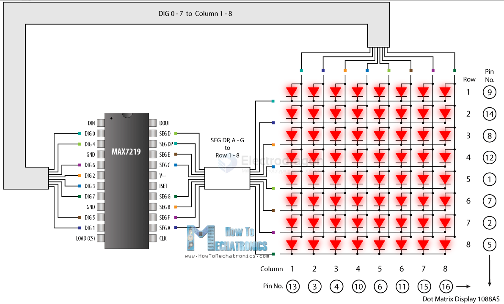
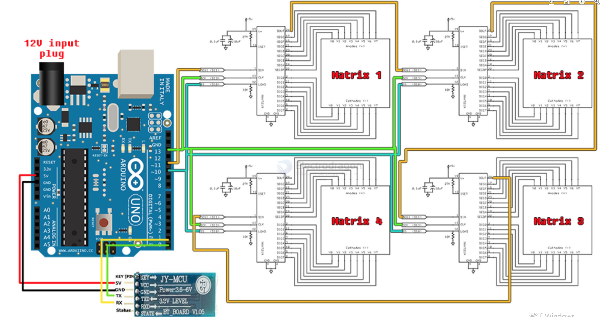

# MAX7219-dat

[MAX7219/MAX7221 Serially Interfaced, 8-Digit LED Display Drivers](https://www.analog.com/media/en/technical-documentation/data-sheets/max7219-max7221.pdf)

## boards 

- [[IMS1008-dat]] - [[IMS1009-dat]] - [[IMS1010-dat]]

## wiring 

from arduino 

- 5V → vcc 
- GND → GND
- pin 12 → DIN
- pin 11 → CLK 
- pin 10 → CS

## ref 

- [[maxim-dat]]