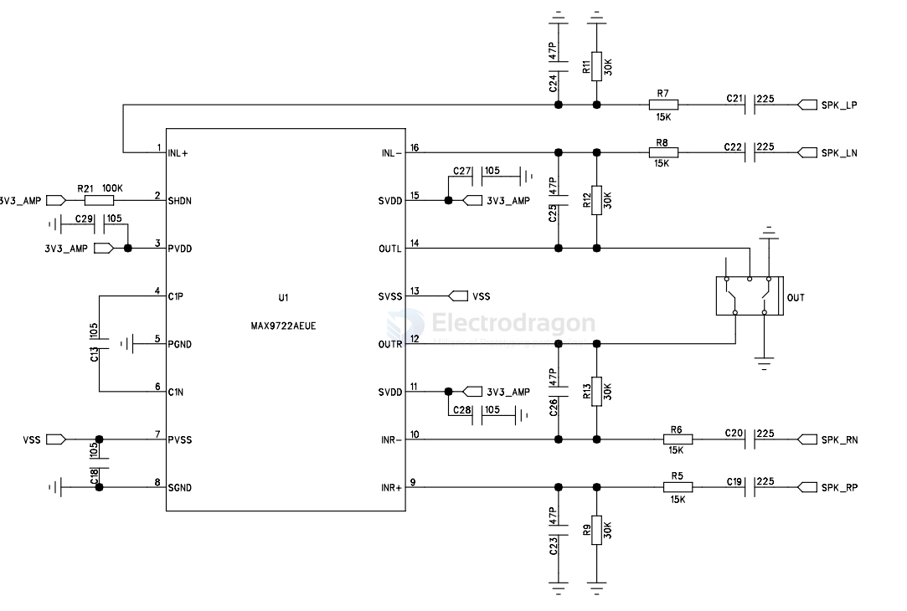

# maxim-dat

- [[analog-device-dat]] - [[maxim-dat]]

- [[maxim-dat]] - [[MAX4622-dat]]

- [[ICL7135-dat]] - [[Maxim-dat]] - [[ADC-dat]]

## maxim-audio 

- [[max9812-dat]]
- max9813
- max9814

- [[MAX2659-dat]]

- [[MAX7219-dat]] 

MAX9722A/MAX9722B - 5V, Differential Input, DirectDrive, 130mW Stereo Headphone Amplifiers with Shutdown

## RS232 

- [[RS232-dat]]

- MAX3387EEUG - 3V, ±15kV ESD-Protected, AutoShutdown Plus RS-232 Transceiver for PDAs and Cell Phones

## RTC 

MAX31328 == ±3.5ppm, I2C RTC with Integrated Crystal and Power Management

The MAX31328 is a low-cost, extremely accurate, I2C real-time clock (RTC) with an integrated temperaturecompensated crystal oscillator (TCXO) and crystal. The device incorporates a battery input and maintains accurate timekeeping when main power to the device is interrupted. The integration of the crystal resonator enhances the long-term accuracy of the device and eliminates the external crystal requirement in the system. The MAX31328 is available in a 10-pin LGA package.

## LDO 

MAX1735 - 200mA, Negative-Output, Low-Dropout Linear Regulator in SOT23

Features
- ♦ Guaranteed 200mA Output Current
- ♦ Low 80mV Dropout Voltage at 200mA
- ♦ Low 85µA Quiescent Supply Current
- ♦ Low 1nA Current Shutdown Mode
- ♦ Stable with 1µF COUT
- ♦ PSRR >60dB at 100Hz
- ♦ Thermal Overload Protection
- ♦ Short-Circuit Protection
- ♦ -5.0V, -3.0V, or -2.5V Output Voltage or Adjustable (-1.25V to -5.5V)
- ♦ Tiny SOT23-5 Package

https://www.analog.com/media/en/technical-documentation/data-sheets/max1735.pdf

## ref 

- [[chip-dat]]