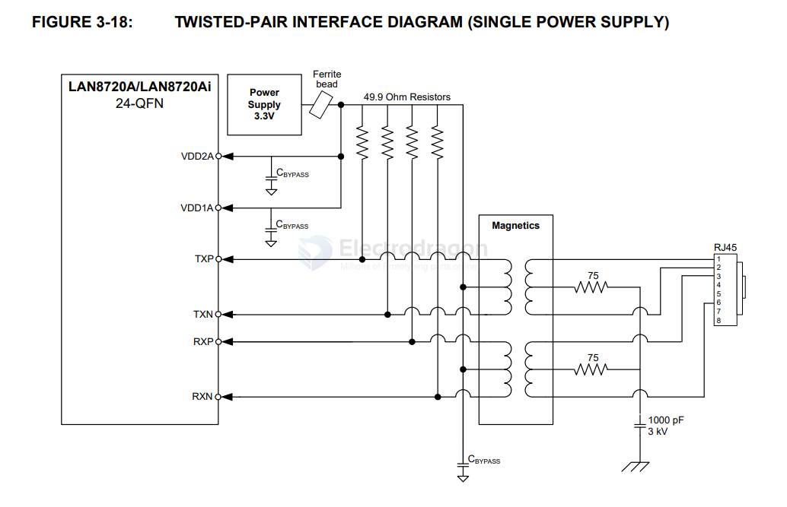

# LAN8720 DAT

- https://ww1.microchip.com/downloads/en/devicedoc/00002165b.pdf

## TWISTED-PAIR INTERFACE DIAGRAM (SINGLE POWER SUPPLY)

## Chip Features 

- High Performance 10/100 Ethernet Transceiver (PHY)
- Ultra low power design with single 3.3V supply
- The RMII interface greatly reduces the control pin of the MCU
- Support HP Auto-MIDX
- The chip is available in a 24-pin QFN package (4x4 mm), lead-free
- Flexible power management architecture
- Integrated 1.2V regulator
- IO voltage range: +1.6V to +3.6V
- Fully pin compatible with ESP32 devkitc board. Only 12 pins used.

## Chip Version 

- a) LAN8720Ai-CP-TR
- Industrial temp., Tape & Reel, 24-QFN (Punch)
- b) LAN8720A-CP-ABC
- Ext. commercial temp., Tray, 24-SQFN (Sawn)

## Debug 

- a good Ethernet cable is necessary, if you have connection problem, please try to obivate this.

## ref 

- [[LAN8720]]