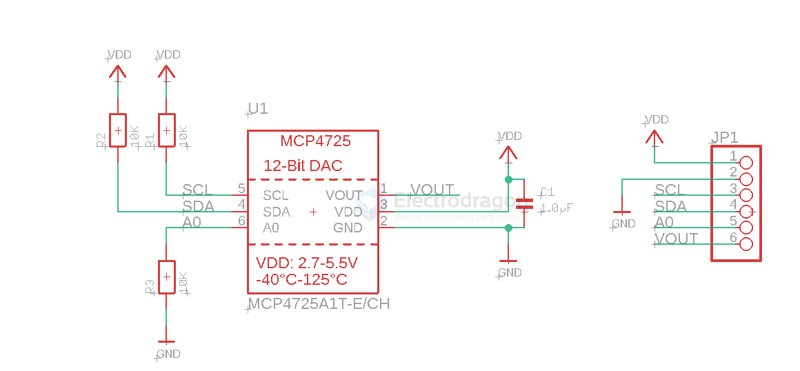
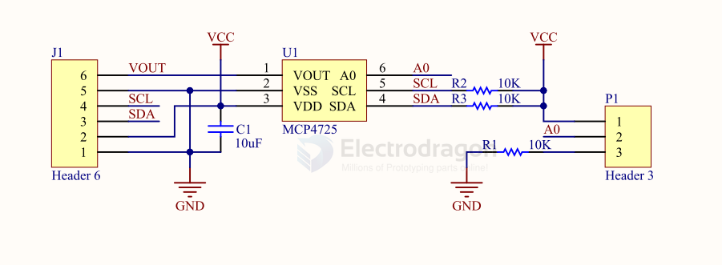

# MCP4725-dat

The MCP4725 is a low-power, high accuracy, single channel, 12-bit buffered voltage output Digital-toAnalog Convertor (DAC) with non-volatile memory (EEPROM). 

Its on-board precision output amplifier allows it to achieve rail-to-rail analog output swing.

- [[I2C-dat]] - [[MCP4725-dat]] - [[microchip-dat]] - [[DAC-dat]]

## SCH 

SCH2 

## ref 

- [[microchip-dat]]