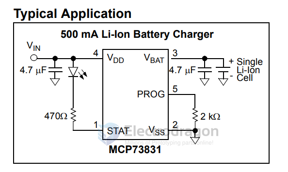
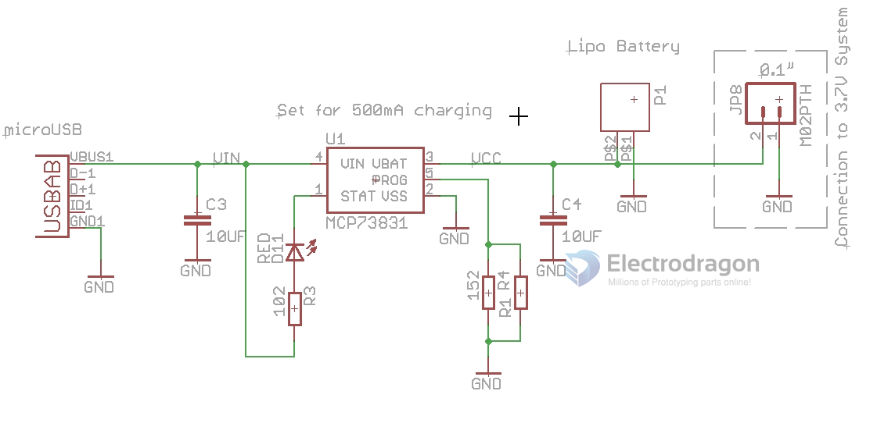

# MCP73831-dat

- datasheet - [[MCP73831.pdf]]

## SCH 

## charge rate 

- 2K for 500mA
- 10K for 100mA
- 67K for 14.5mA

Our pre-solder board [[OPM1193-dat]] use 2K for 500mA charging speed 

## ref 

- [[battery-charger-dat]]

- [[MCP73831]]

- [[TP-dat]]