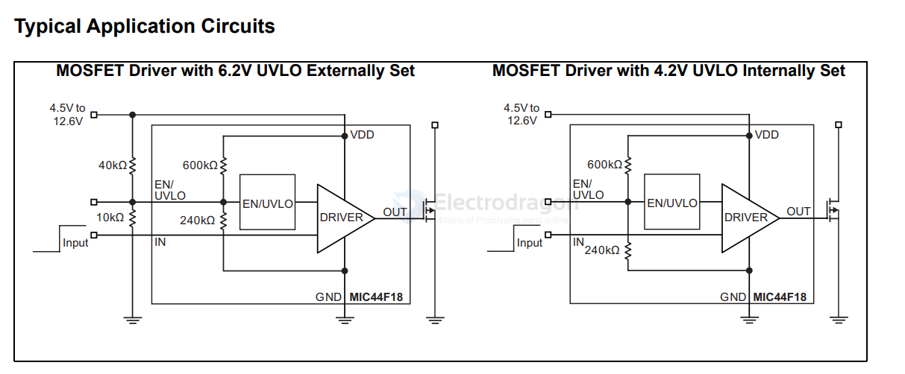

# MIC44F18-dat

- [[MIC44F18-dat]] - [[microchip-dat]] - [[mosfet-driver-dat]]

Features

- • 4.5V to 12.6V Input Operating Range
- • 6A Peak Output Current
- • High Accuracy ±5% Enable Input Threshold
- • High Speed Switching Capability
   - 10 ns Rise Time in 1000 pF Load
   - <15 ns Propagation Delay Time
- • Flexible UVLO Function
   - 4.2V Internally Set UVLO
   - Programmable with External Resistors
- • Latch-Up Protection to >500 mA Reverse Current on the Output Pin
- • Enable Function
- • Thermally Enhanced ePAD MSOP-8 Package Option
- • Miniature 2 mm x 2 mm DFN-8 Package Option
- • Pb-Free Packaging

Applications

• Synchronous Switch-Mode Power Supplies
• Secondary Side Synchronous Rectification

General Description

The MIC44F18, MIC44F19, and MIC44F20 are
high-speed single MOSFET drivers capable of sinking
and sourcing 6A for driving capacitive loads. With delay
times of less than 15 ns and rise times into a 1000 pF
load of 10 ns, these MOSFET drivers are ideal for
driving large gate charge MOSFETs in power supply
applications. The MIC44F18 is a non-inverting driver,
the MIC44F19 is an inverting driver suited for driving
P-Channel MOSFETs, and the MIC44F20 is an
inverting driver for N-Channel MOSFETs.

Fabricated using proprietary BiCMOS/DMOS process
for low power consumption and high efficiency, the
MIC44F18/19/20 translates TTL or CMOS input logic
levels to output voltage levels that swing within 25 mV
of the positive supply or ground. Comparable bipolar
devices are capable of swinging only to within 1V of the
supply.

The input supply voltage range of the MIC44F18/19/20
is 4.5V to 12.6V, making the devices suitable for driving
MOSFETs in a wide range of power applications. Other
features include an enable function, latch-up
protection, and a programmable UVLO function.

The MIC44F18/19/20 has a junction temperature range
of –40°C to +125°C with exposed pad ePAD MSOP-8
and 2 mm x 2 mm DFN-8 package options.

## SCH 

## ref 