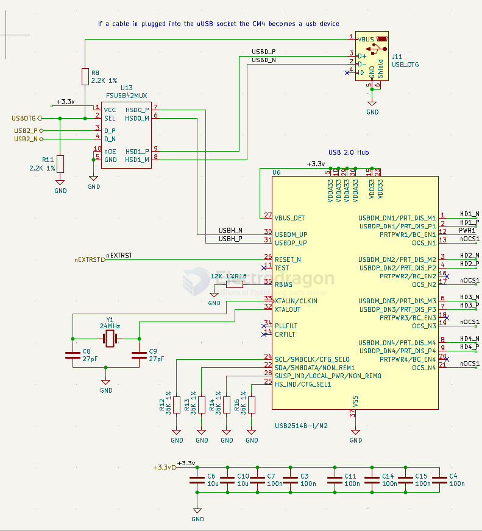
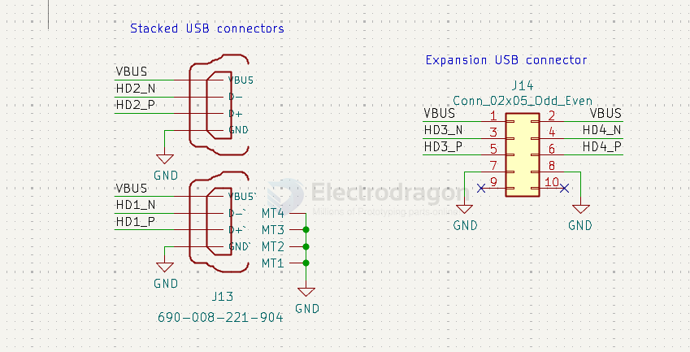
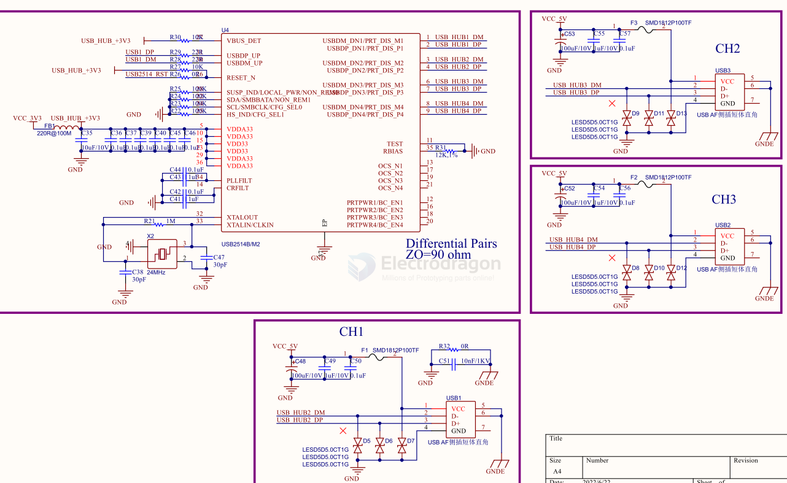

# USB2514B-dat

## USB2514

[USB2514 - USB251xB/USB251xBi USB 2.0 Hi-Speed Hub Controller Data Sheet](https://ww1.microchip.com/downloads/aemDocuments/documents/OTH/ProductDocuments/DataSheets/00001692C.pdf)

The Microchip USB251xB/xBi hub is a family of lowpower, configurable, MTT (multi transaction translator) hub controller IC products for embedded USB solutions. 

The x in the part number indicates the number of downstream ports available, while the B indicates battery charging support. 

The Microchip hub supports lowspeed, full-speed, and hi-speed (if operating as a hispeed hub) downstream devices on all of the enabled downstream ports.

SCH 

## ref 

- [[microchip-dat]]