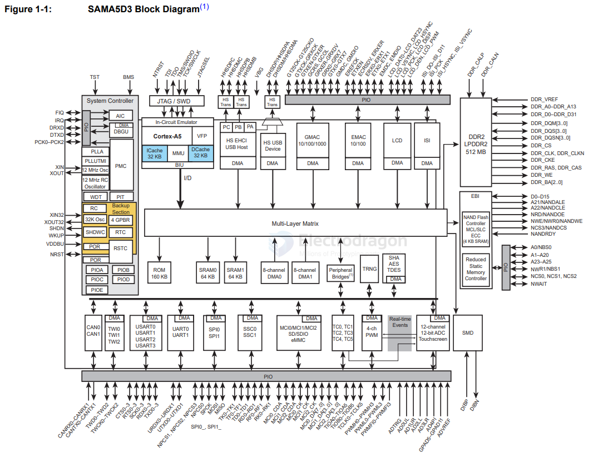

# SAMA5D3-dat

- [[SAMA5D3-dat]] - [[microchip-MCU-dat]] - [[mcu-dat]]

SAMA5D3 Series

Low-Power Arm® Cortex®-A5 Processor-Based MPU, 536 MHz, FPU, Gigabit Ethernet with IEEE®1588 plus 10/100 Ethernet, Dual CAN, AES, SHA
 
- [[CAN-dat]] - [[AES-dat]] - [[SHA-dat]] - [[ethernet-dat]] - [[ARM-dat]] - [[BGA-dat]]

https://ww1.microchip.com/downloads/aemDocuments/documents/MPU32/ProductDocuments/DataSheets/SAMA5D3-Series-Data-Sheet-DS60001609.pdf

## diagram 

## ref 