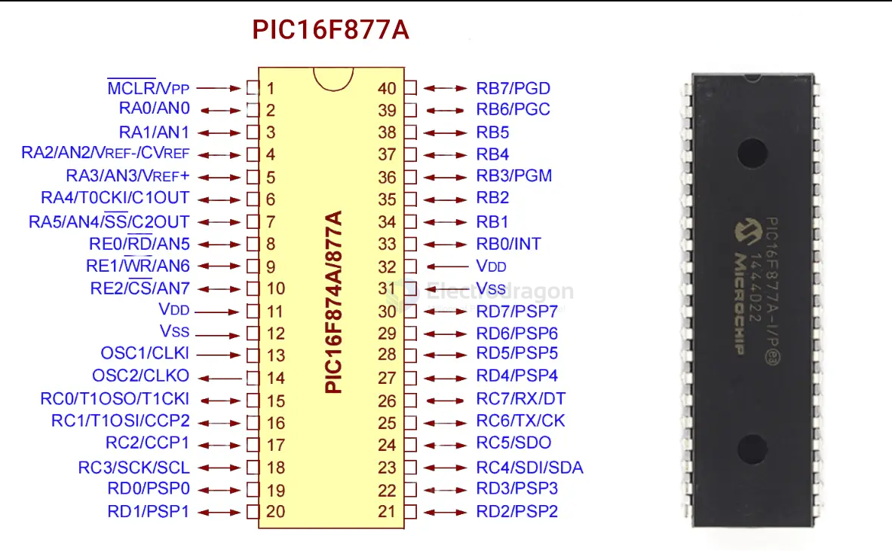

# microchip-MCU-dat

- [[mcu-dat]]

- [[samd21-dat]]

- [[avr-dat]]

## microchip-MCU 

### PIC24 

PIC24FJ128GB106-I/PT - PIC PIC® 24F Microcontroller IC 16-Bit 32MHz 128KB (43K x 24) FLASH 64-TQFP (10x10)
 

### PIC32 

PIC32CX1025SG61100 - PIC32CX 1MB Flash/256KB RAM with OTP Security and Secure Subsytem

PIC32MZ2064DAG176

### PIC16 

PIC16F877A - 28/40/44-Pin Enhanced Flash Microcontrollers

PIC16F18877

PIC16F84A - 18-pin Enhanced FLASH/EEPROM 8-bit Microcontroller

## ref 

- [[microchip-dat]]