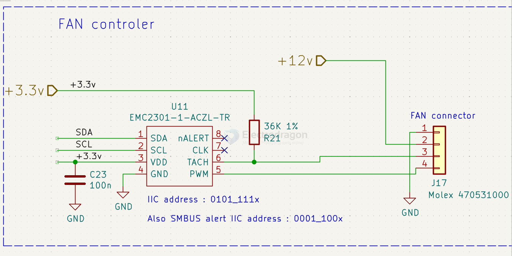

# microchip-dat

- [[microchip-MCU-dat]]

LAN8710A/8720A - SMSC

MCP1253 == Low Noise, Positive-Regulated Charge Pump

- [[USB-hub-dat]] - [[USB2514B-dat]]

- [[mosfet-driver-dat]]

## fan control 

EMC2301/2/3/5

Single/Multiple RPM-Based PWM Fan Controller

- TACH 1 == Tach 1 Input

## MCP4017 

- [[digital-pot-dat]]

MCP4017 == 7-Bit Single Digital POT in SC70 w/I2C™

- [[TI-power-dat]]

## ethernet

- [[ethernet-dat]]

## module 

RNWF11

RNWF11PC-I100 - 

The RNWF11 Module is a low-power 2.4 GHz IEEE® 802.11b/g/n compliant, fully RF certified wireless module
designed for Internet of Things (IoT) applications. This module is interfaced via a Two-Wire UART interface
with Microchip’s simple ASCII-based AT commands for easy integration into most of the applications. The host
microcontroller can dynamically configure the RNWF11 Module with a few simple ASCII commands.

- [[IOT-dat]]

## ref 

- [[chip-dat]]