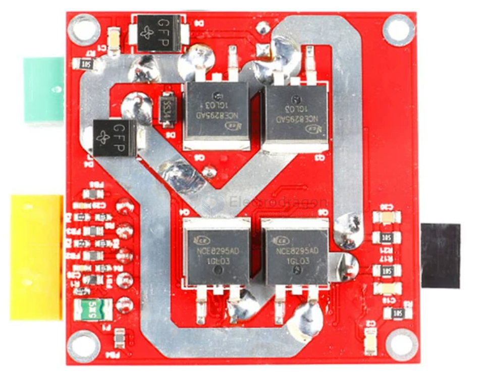
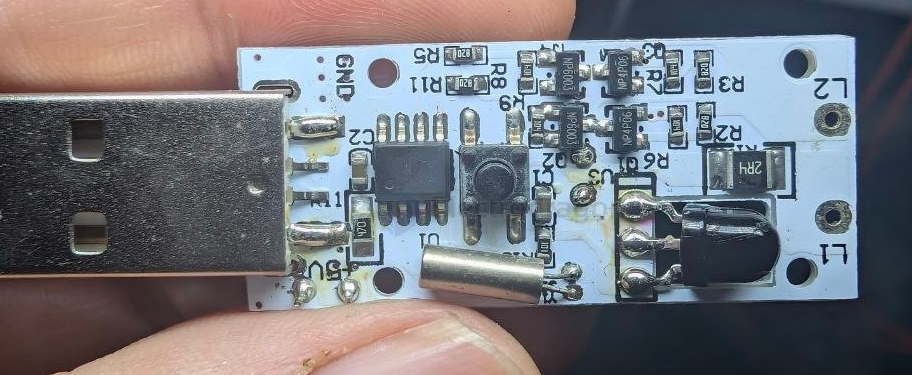

# NCEpower-mosfet-dat

- [[mosfet-dat]] - [[NCEpower-dat]] - [[NCEpower-mosfet-dat]] - [[mosfet-dat]] - [[NCE6050-dat]]

- [[NCEpower-mosfet-dat]] - [[NCE2060K-dat]] - NCE N-Channel Enhancement Mode Power MOSFET 

| NCE6050           |      | [[ncepower-dat]] | 50A   | TO-252          | N       | 60V     |

## NCE8295 

## NCE6003X

NP4P06 + NCE6003

- [[NCE6003-dat]] - [[NCEpower-mosfet-dat]]

NCE N-Channel Enhancement Mode Power MOSFET

VDS =60V,ID =3A

## build 

- [[natlinear-dat]] - [[NCEpower-mosfet-dat]] - [[NP4P06-dat]] - [[NCE6003-dat]] 

## ref 

