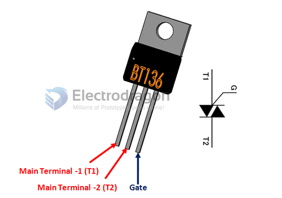
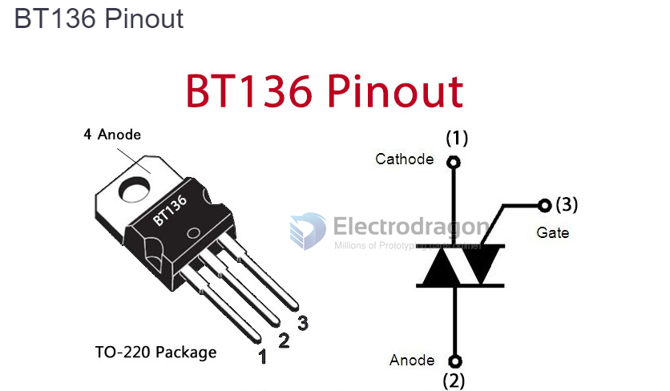

# BT136-dat 

- 1 Main Terminal_1 Connected to Phase or neutral of AC mains
- 2 Main Terminal_2 Connected to Phase or neutral of AC mains
- 3 Gate Used to trigger the SCR.

## Features

- Maximum Terminal current: 4A
- On-state Gate voltage: 1.4V
- Gate trigger current: 10mA
- Max Terminal Voltage is 600 V
- Holding current: 2.2mA
- Latching current: 4mA
- Available in To-220 Package
Note: Complete Technical Details can be found in the datasheet present at the end of this page.

## ref 
- DS [[BT136.pdf]]