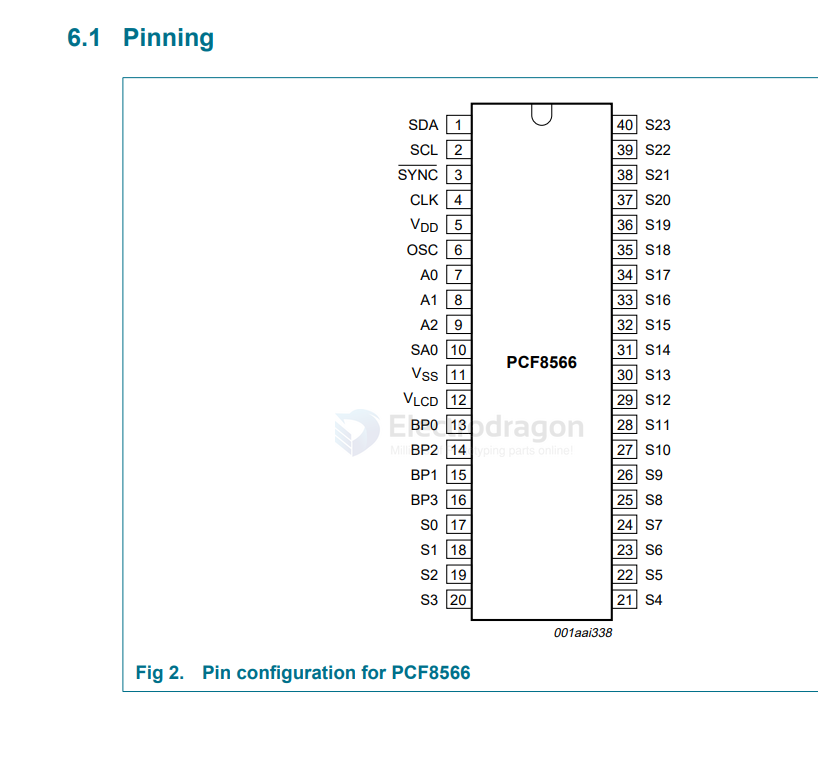

# NXP-dat

[[NXP-CAN-dat]] - [[TJA1050-dat]]

- [[i.MX6ULL-dat]]

- [[PCA9685-dat]]

- PCF8566 == Universal LCD driver for low multiplex rates - Rev. 07 — 25 February 2009

- [PCF8591 8-bit A/D and D/A converter](https://www.nxp.com/docs/en/data-sheet/PCF8591.pdf)

- TCA9548 
- PCA9548

PCF85176 == 40 x 4 universal LCD driver for low multiplex rates

[PCF8523 == Real-Time Clock (RTC) and calendar](https://www.nxp.com.cn/docs/en/data-sheet/PCF8523.pdf)

- [[PCF8574-dat]]

### PCF8566 

## I2S

- [[UDA1334-dat]]

## RTC

- [[RTC-dat]]

- PCF85063A
- PCF8563 Real-time clock/calendar
PCF8563T/5,518

## ref 

- [[CAN-dat]]