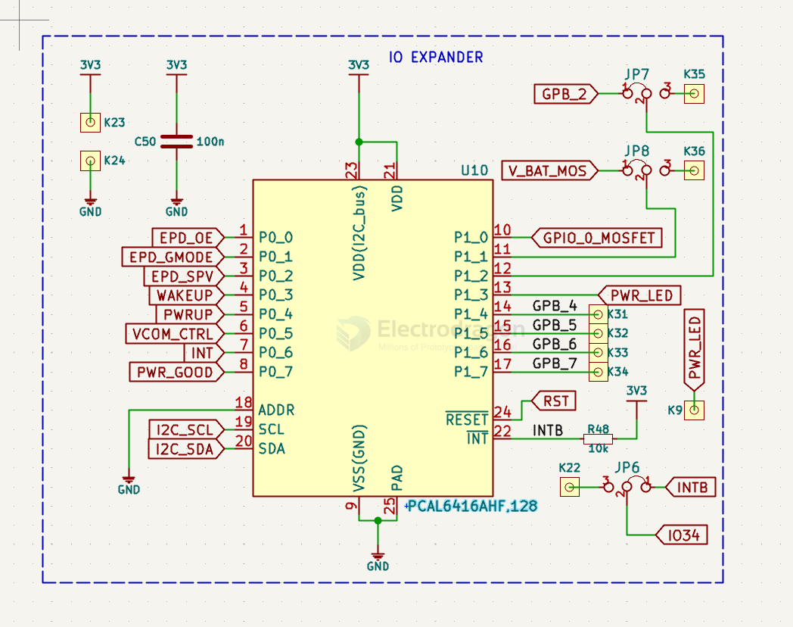

# NXP-io-expander-dat

- [[NXP-dat]] - [[io-expander-dat]] - [[NXP-io-expander-dat]]

- [[io-expander-dat]] - [[GPIO-dat]] - [[NXP-dat]] - [[NXP-io-expander-dat]]

PCAL6416AHF,128

Low-voltage translating 16-bit I2C-bus/SMBus I/O expander with interrupt output, reset, and configuration registers

PCA8574

pcf8574

pcf8575

## ref 

