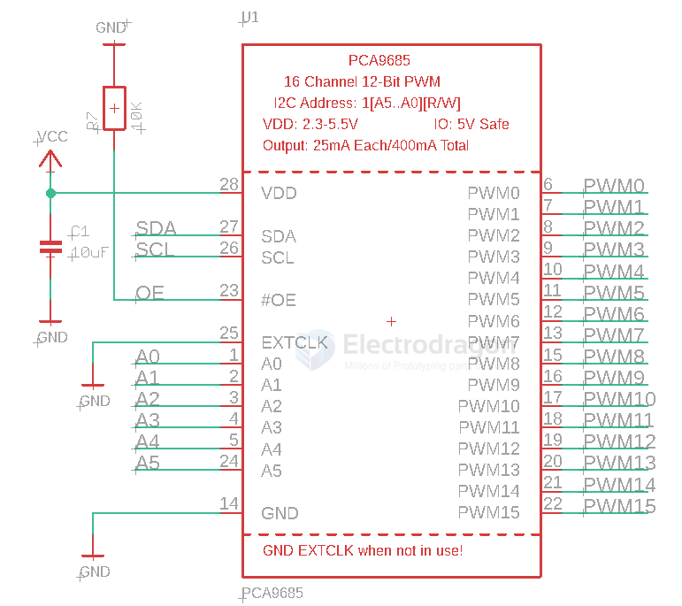
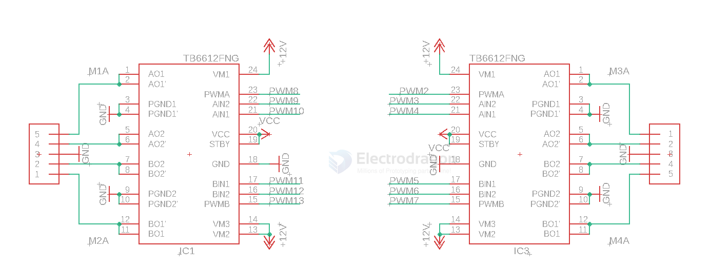

# PCA9685-dat

## Info 
 
chip info, [datasheet](https://www.nxp.com/docs/en/data-sheet/PCA9685.pdf), etc.

The PCA9685 is an I²C-bus controlled 16-channel LED controller optimized for Red/Green/Blue/Amber (RGBA) color backlighting applications.

16-channel, 12-bit PWM Fm+ I2C-bus LED controller

- 16CH [[PWM-dat]] output
- A0~A5 [[I2C-dat]] address setup 

## SCH 

### 4X motors control by 2X [[TB6612-dat]]

- [[TB6612-dat]]

## board 

- [[SDR1090-dat]] - [[SDR1087-dat]] 

- [[SDR1062-dat]] 

## App. 

- [[servo-dat]]

## ref 

- [[TLC5940-dat]]

- [[I2C-dat]]
 
- [[NXP-dat]]
 
- [[PCA9685]]