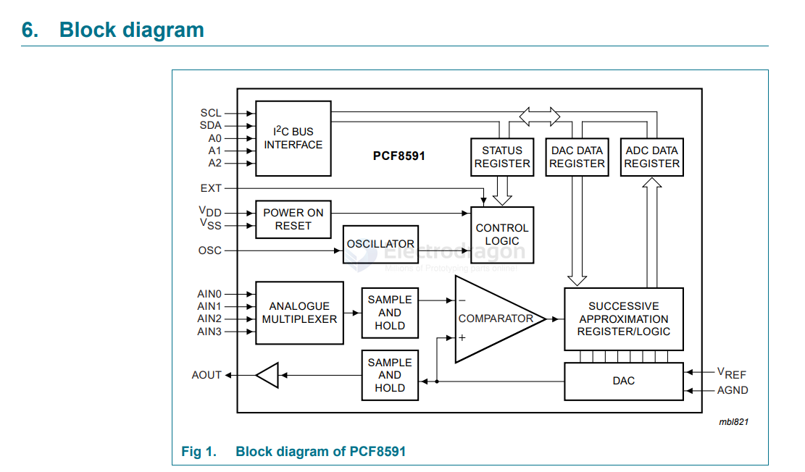

# PCF8591-dat

## board 

- [[MSP1064-dat]] - [[PCF8591-dat]]

## info 

- [[ADC-dat]] - [[DAC-dat]] - [[sensor-dat]]

The PCF8591 is a single-chip, single-supply low-power 8-bit CMOS data acquisition device with four analog inputs, one analog output and a serial I2C-bus interface. Three address pins A0, A1 and A2 are used for programming the hardware address, allowing the use of up to eight devices connected to the I2C-bus without additional hardware. Address, control and data to and from the device are transferred serially via the two-line bidirectional I2C-bus.

The functions of the device include analog input multiplexing, on-chip track and hold function, 8-bit analog-to-digital conversion and an 8-bit digital-to-analog conv

https://www.nxp.com/docs/en/data-sheet/PCF8591.pdf

## diagram 

## ref 

- [[NXP-dat]]