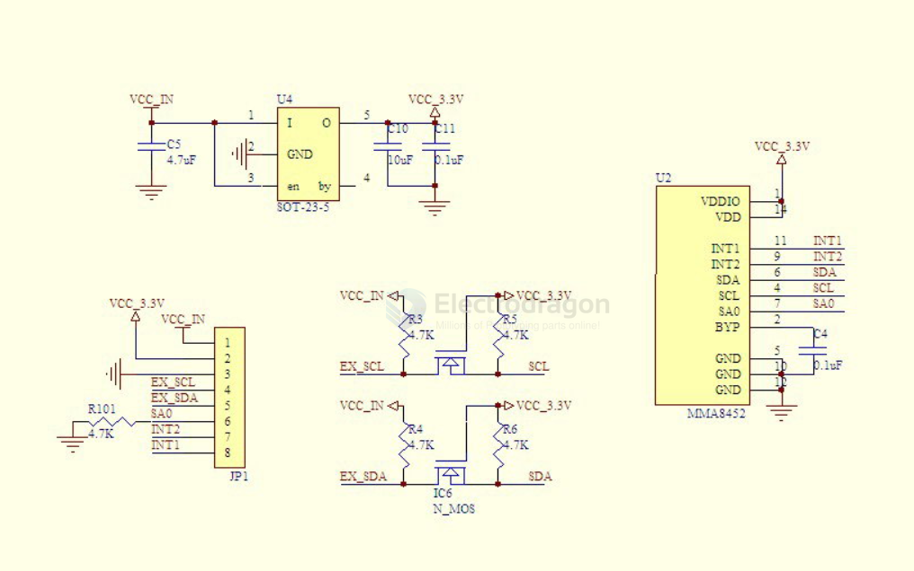

# freescale-dat

- [[MMA8452-dat]] - [MMA8452Q 3-axis, 12-bit/8-bit digital accelerometer](https://www.nxp.com/docs/en/data-sheet/MMA8452Q.pdf)

- [[MMA7361-dat]] - [[MMA7455-dat]] - [[freescale-dat]] - [[NxP-dat]]

- [[3-axis-Accelerometer-dat]]

[compare - Compare freescale sensors on this page.](http://www.freescale.com/webapp/sps/site/taxonomy.jsp?nodeId=01126911184209#60)

## MMA8452 

SCH 

## Features of MMA7361: (Old type)

- Use MMA7361(instead of MMA7260) cheap and micro capacitor version accelerometer.
- Support 5V/3.3V input voltage, TR9161 on board,  much lower voltage drop compare to 1117, much faster response, very suitable for industrial environment
- Can be measured by IO of MCU as well as resitor
- common pins are already pointed out, use standard 2.54mm break away pin header, easy for prototyping
- Can go to sleep by send command via MCU
- Dimension:27.9 mm* 16.8mm

[MMA7361L Datasheet](http://www.sparkfun.com/datasheets/Components/General/MMA7361L.pdf)

## Features of MMA7455:  (Old type)

- Onboard MMA7455 digital output (supports I2C/SPI), low power consumption and compact capacitive micromachined acceleration sensor;
- Support 5V voltage input, onboard RT9161 power chip, lower pressure drop than the 1117, faster load the appropriate speed, ideal for high noise power environment;
- The pin has been commonly leads, pin standard 100mil (2.54mm), easy for lattice panels;
- PCB board sided gold-plated, Size: 24.9 (mm) x12.7 (mm)

## ref 

- [[freescale-dat]] - [[NxP-dat]]