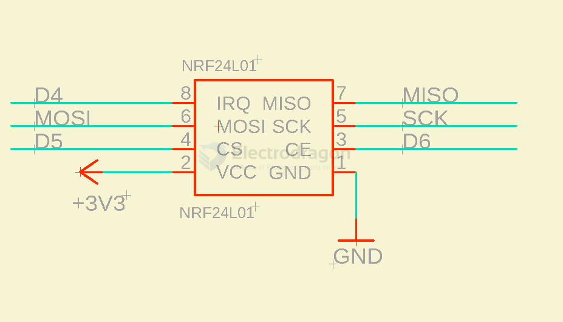

# NRF24L01-dat

https://w.electrodragon.com/w/Category:NRF24#NRF24L01_with_STC_C51_MCU

## Feature of NRF24L01:

- 2.4Ghz worldwide free open ISM band
- High working speed up to 2Mbps, high efficient GFSK modulation, can transfer audio or video.
- 125 channels for multiple communication or jumping channels communication.
- Embedded CRC error-check and point to mutiple point communication control
- operation voltage at 3.0-3.6V (3V3)
- External 2.4Ghz antenna, compact size 18mm * 30mm
- Module can set address by software, only output data when device receive right address, can directly connect to any MCU, and easy to programmer.
- 2.54 pins space, compatible with normal module interface, easy to replace.
- 51, AVR reference code is available, simply copy and modify
- Transfer distance can reach 1000 meters @ 250 Kbps (normally can reach 0.8KM)

## boards 

[[arduino-dat]] integrated 
- [[DVA1002-dat]]

Genuine Chip
- [[NWL1053-dat]]

Long range version 
- [[NWL1050-dat]]
  
NRF24L01-TW version 
- [[NWL1032-dat]] - [[NWL1010-dat]] 

- [[RF-dat]]

## SCH 

with STM32 

with arduino 

## demo code 

- http://electrodragon.com/?p=1134

## ref 

- [legacy wiki page](https://w.electrodragon.com/w/Category:NRF24)

[[A7105-dat]]: - [[NWL1058-dat]]