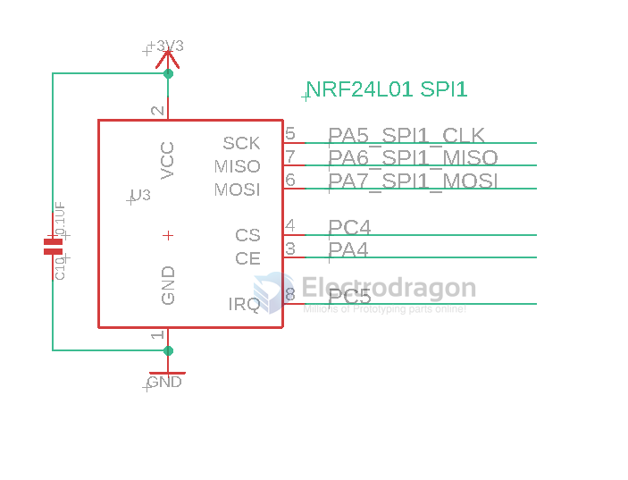
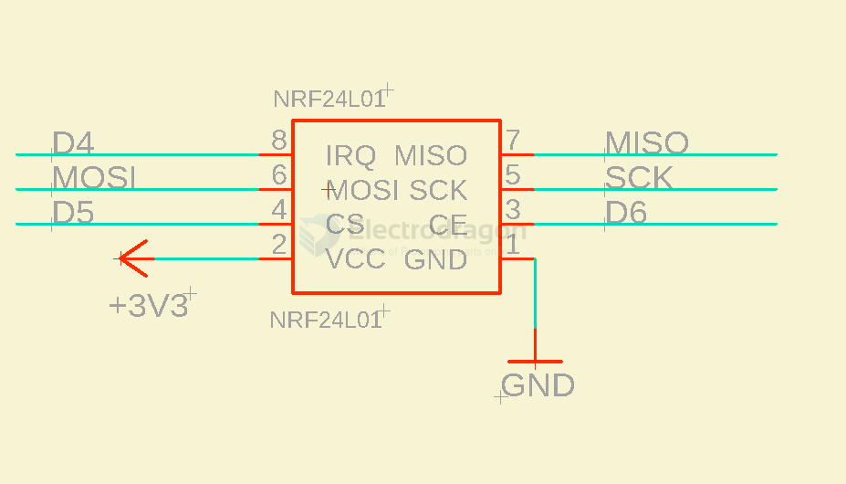
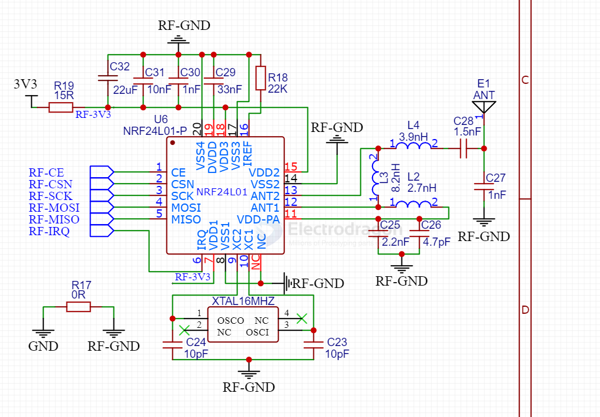

# NRF24L01-dat

https://w.electrodragon.com/w/Category:NRF24#NRF24L01_with_STC_C51_MCU

- [[LNA-dat]]

- [[NRF24L01-clone-dat]]

## Feature of NRF24L01:

- 2.4Ghz worldwide free open ISM band
- High working speed up to 2Mbps, high efficient GFSK modulation, can transfer audio or video.
- 125 channels for multiple communication or jumping channels communication.
- Embedded CRC error-check and point to mutiple point communication control
- operation voltage at 3.0-3.6V (3V3)
- External 2.4Ghz antenna, compact size 18mm * 30mm
- Module can set address by software, only output data when device receive right address, can directly connect to any MCU, and easy to programmer.
- 2.54 pins space, compatible with normal module interface, easy to replace.
- 51, AVR reference code is available, simply copy and modify
- Transfer distance can reach 1000 meters @ 250 Kbps (normally can reach 0.8KM)

## Variations

*   **NRF24L01:** The original, basic version.
*   **NRF24L01+ (Plus):** Improved version with lower current consumption and better sensitivity.
*   **NRF24L01-TW / NRF24L01B:**  Appears to be the same as NRF24L01, but with +7dBm transmit power.
*   **Long Range Versions (+20dBm):** Offers significantly extended range due to the higher transmit power. Example: [[NWL1050-dat]].

## boards 

[[arduino-dat]] integrated board - [[DVA1002-dat]]

Genuine Chip - [[NWL1053-dat]]

Long range version == +20 DBm - [[NWL1050-dat]]
  
NRF24L01-TW version == NRF24L01B == Power at +7Db - [[NWL1032-dat]] 

cost-effective cheap version == 24L01 - [[NWL1010-dat]] 

- [[RF-dat]]

## NRF24L01+ Info 

Operates in the global open ISM band, maximum 0dBm transmit power, license-free use.
Supports data reception on six channels.

1.  **Low Operating Voltage:** 1.9V to 3.6V low voltage operation.
2.  **High Data Rate:** 2Mbps. The short air transmission time significantly reduces collisions in wireless transmission (Air data rate configurable to 1Mbps or 2Mbps via software).
3.  **Multi-Frequency Points:** 125 frequency points, meeting the needs of multi-point communication and frequency hopping.
4.  **Ultra-Small Size:** Built-in 2.4GHz antenna, compact size, 15x29mm (including antenna).
5.  **Low Power Consumption:** Fast air transmission and startup time when operating in acknowledgment mode communication significantly reduce current consumption.
6.  **Low Application Cost:** NRF24L01 integrates all high-speed signal processing related to the RF protocol, such as automatic retransmission of lost packets and automatic generation of acknowledgment signals. The NRF24L01's SPI interface can be connected using the MCU's hardware SPI port or simulated using MCU I/O ports. The internal FIFO can interface with various high and low-speed microprocessors, facilitating the use of low-cost MCUs.
7.  **Ease of Development:** The link layer is fully integrated into the module, making development very convenient. Features include:
    *   Automatic retransmission function (automatically detects and retransmits lost packets, retransmission time and count are software controllable).
    *   Automatic storage of packets without acknowledgment signals.
    *   Automatic acknowledgment function (module automatically sends acknowledgment signal after receiving valid data, no extra programming needed).
    *   Carrier detection (fixed frequency detection).
    *   Built-in hardware CRC error detection and point-to-multipoint communication address control.
    *   Packet transmission error counter.
    *   Carrier detection function for frequency hopping setup.
    *   Ability to set six receiving channel addresses simultaneously.
    *   Selective opening of receiving channels.
    *   Standard 2.54mm pitch DIP pins for easy embedded applications.

## SCH 

with STM32 

with arduino 

## Core SCH 

## demo code 

- http://electrodragon.com/?p=1134

## APPs 

- [[WCH-fly-dat]]

## ref 

- [[NRF24L01-clone-dat]]

- [[antenna-dat]]

- [legacy wiki page](https://w.electrodragon.com/w/Category:NRF24)

[[A7105-dat]] - [[NWL1058-dat]]

- [[MD7105-dat]]

- [[RF-2.4Ghz-dat]] - [[RF-dat]]