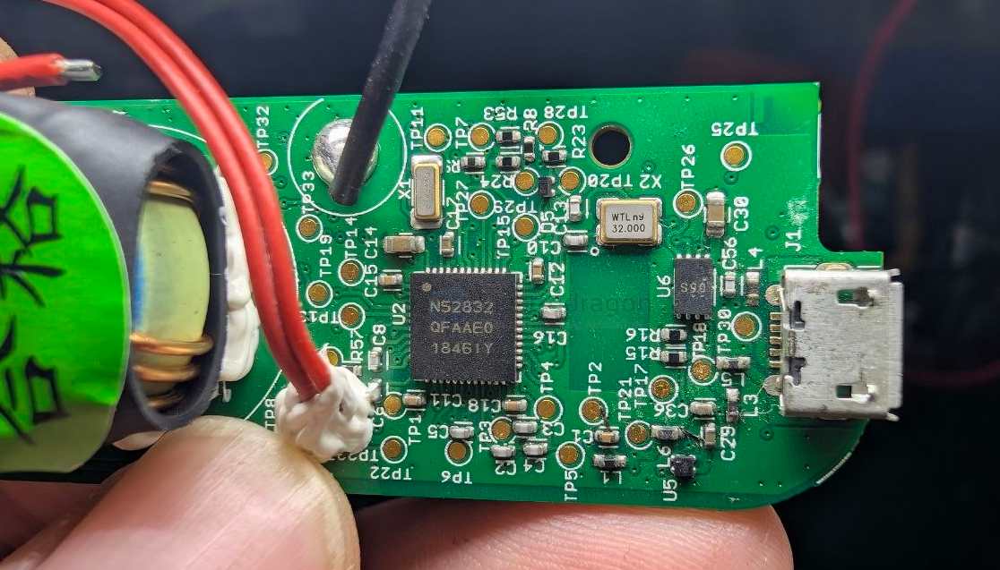
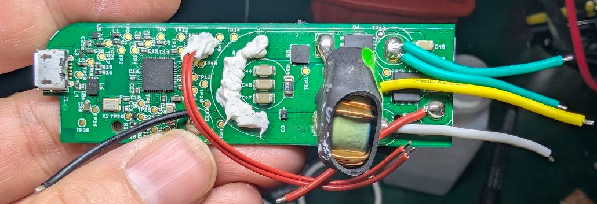
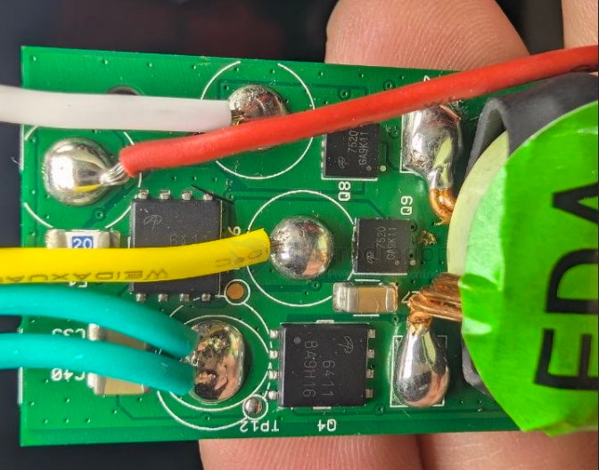
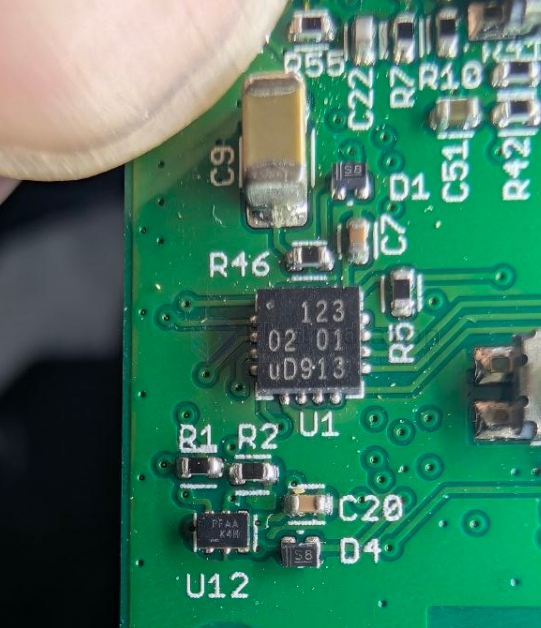
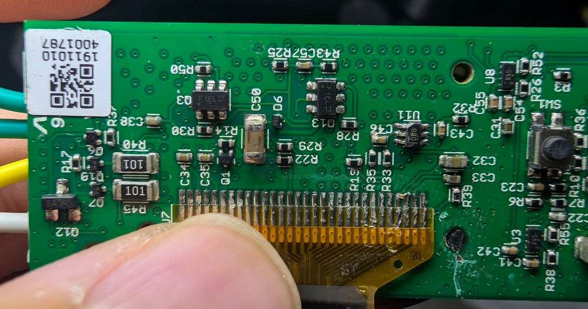
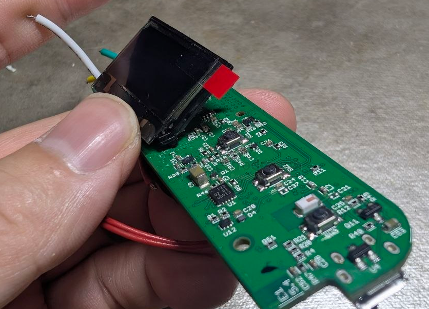

# NRF52832-dat

- [[NRF5x-dat]] - [[NRF52832-dat]] - [[NRF52840-dat]] - [[nordic-dat]] - [[NFC-dat]] - [[bluetooth-dat]]

- [[battery-dat]] - [[sensor-dc-voltage-dat]]

## chip 

- QFN-36 

- [[NFC-dat]] P09 / P10 

- [[DFU-dat]] P0.20

- [[serial-dat]] P0.06 == TXD / P0.08 == RXD 

debug connector

SWDIO  (pad) / SWDCLK  (pad) / P0.18 == SWO / P0.21 == reset 

P0.22 == FRST (pad)

module MDBT 42 

## build 

- [[DFN-dat]] - [[PCB-footprint-dat]] == S90

- [[mosfet-dat]] - AON7520 (DFN 3.3x3.3) - [[NRF52832-dat]] - [[DFN-dat]] - [[AOSMD-mosfet-dat]] - [[AON7520-dat]] - [[AON6411-dat]]

back side 

123 02 01 ud913

PFAA K4H 

F1EL

## ref 

- [[NRF52832]] - [[nordic]]