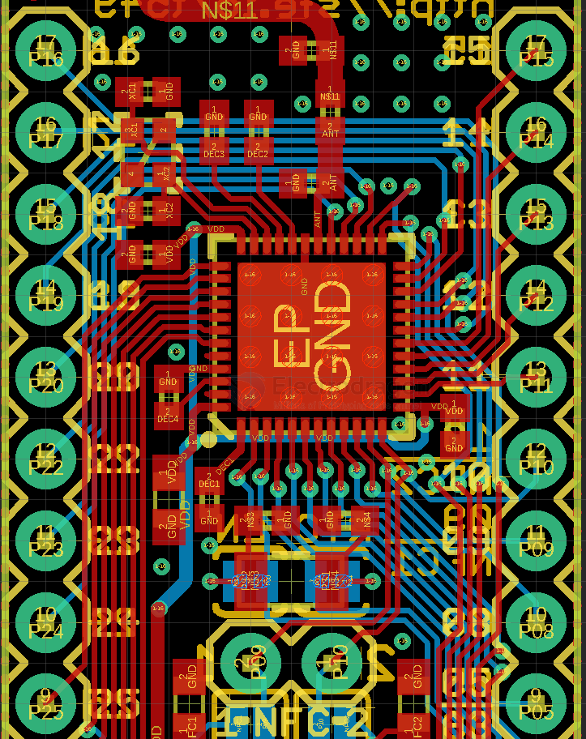
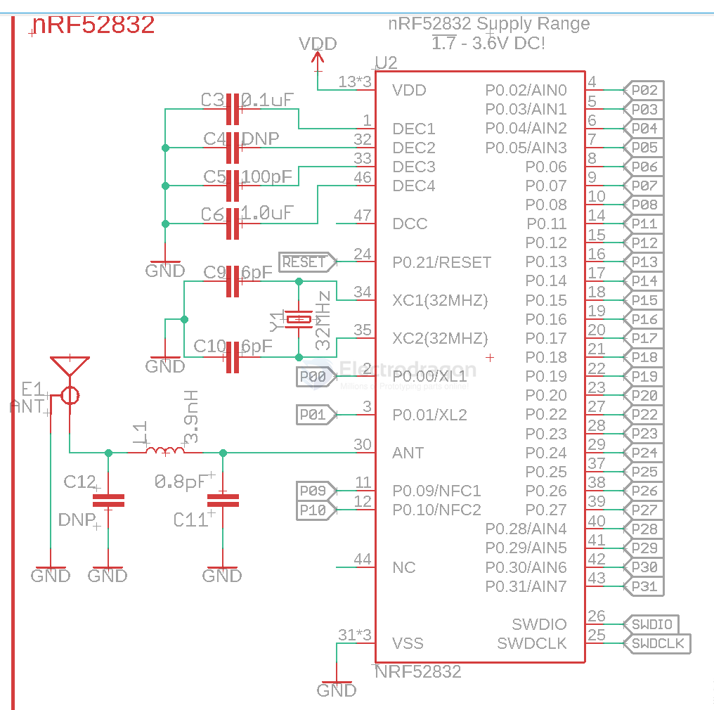
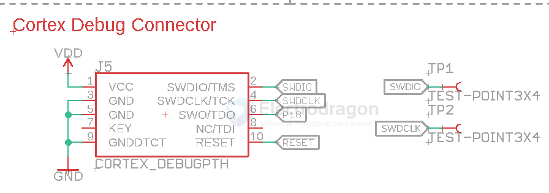
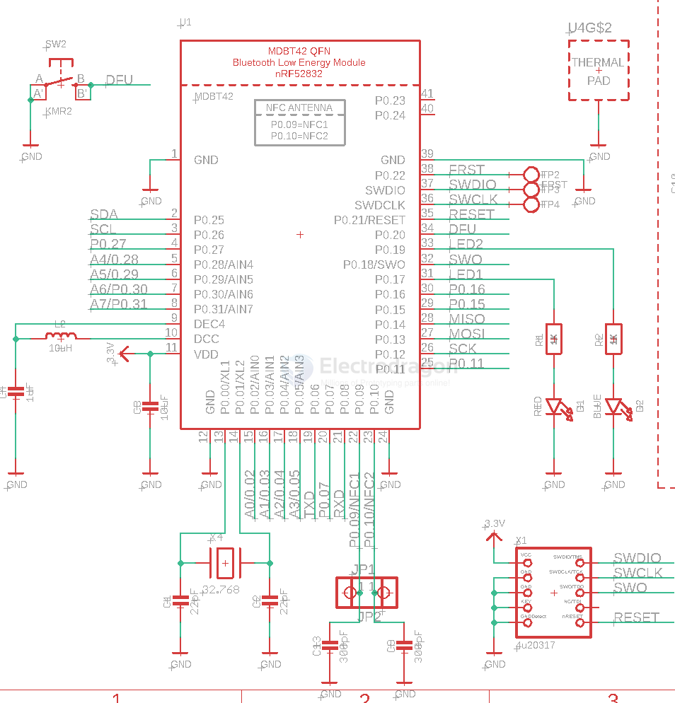

# NRF52832-dat

- [[NRF5x-dat]] - [[NRF52832-dat]] - [[NRF52840-dat]] - [[nordic-dat]] - [[NFC-dat]] - [[bluetooth-dat]]

- [[battery-dat]] - [[sensor-dc-voltage-dat]]

## chip 

- QFN-36 

- [[NFC-dat]] P09 / P10 

- [[DFU-dat]] P0.20

- [[serial-dat]] P0.06 == TXD / P0.08 == RXD 

debug connector

SWDIO / SWDCLK / P0.18 / reset 

module MDBT 42 

## ref 

- [[NRF52832]] - [[nordic]]