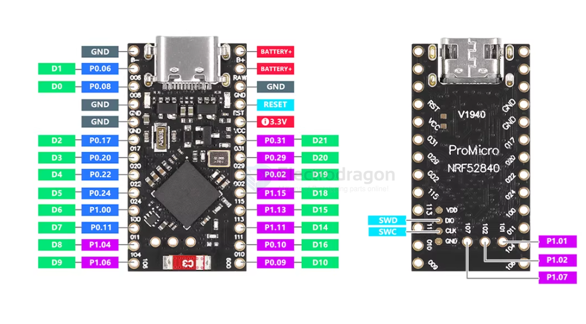
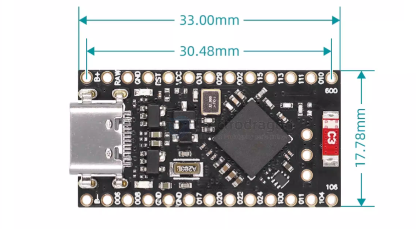
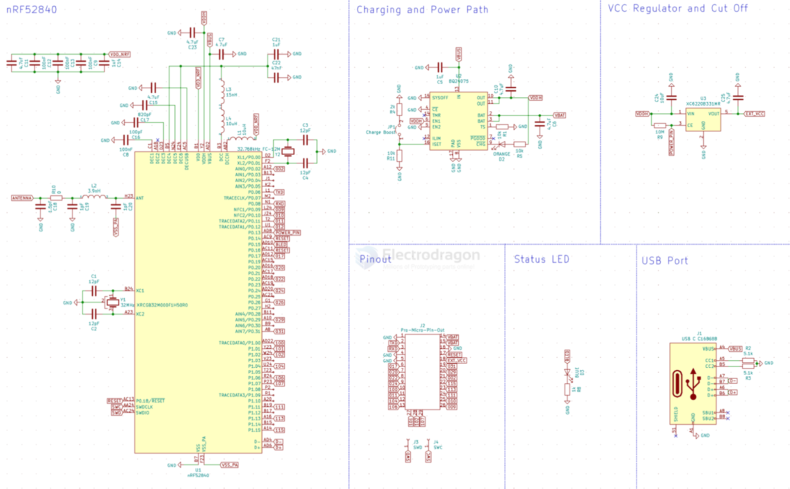

# NRF52840-board-1-dat

- [[arduino-pro-micro-dat]] - [[arduino-dat]]

- [[NRF52840-dat]]

- [[NRF5x-HDK-dat]] - [[NRF52840-board-1-dat]] - [[NRF52840-dat]]

- [[NRF5x-SDK-dat]]

ProMicro NRF52840是一款Pro Micro替代开发板,兼容Nice!Nano，他的引脚与ProMicro相同，意味着他几乎可以与任何ProMicro键盘配合使用。NRF5280开发板上有一个3.7V锂电池接口，和一个软件开关，可以切断LED的电源，在关闭的情况下，待机可以达到1mA的功耗。

强大的无线功能：蓝牙5.0，板载天线
强大的 CPU：nRF52840芯片采用ARM Cortex-M4F处理器，主频为64MHz，内置1MB的闪存和256KB的RAM
电池充电芯片：支持锂电池充放电
功耗：待机可以达到~20uA的功耗

- [[battery-charger-dat]] - [[antenna-dat]]

GPIO == 16 

## pins 

left side 

- GND
- D1 - PO.06
- DO - PO.08
- GND
- GND
- D2 - P0.17
- D3 - P0.20
- D4 - PO.22
- D5 - PO.24
- D6 - P1.00
- D7 - PO.11
- D8 - P1.04
- D9 - P1.06

right side 

- BATTERY+
- BATTERY+
- GND
- RESET
- 03.3V
- PO.31 - D21
- PO.29 - D20
- PO.02 - D19
- P1.15 - D18
- P1.13 - D15
- P1.11 - D14
- PO.10 - D16
- PO.09 - D10

- 1.它的引l脚与ProMicro相同，意味着他几乎可以与任何ProMicro键盘配合使用。NRF5280开发板上有一个3.7V锂电池接口，和一个软件开关，可以切断LED的电源，在关闭的情况下，待机可以达到1mA的功耗。
- 2.NRF52840是一款高性能、低功耗的无线SOC芯片。它支持多种无线协议，包括Bluetooth5、Thread、Zigbee、ANT和2.4GHz。 nRF52840芯片采用ARMCorteX-M4F处理器主频为64MHz，内置1MB的闪存和256KB的RAM。它还具有多种外设，包括ADC、PWM、SPI、I2C、UART、USB和GPIO等。
- 3.强大的无线功能：蓝牙5.0，板载天线。
- 4.强大的CPU：nRF52840芯片采用ARMCorteX-M4F处理器，主频为64MHz，内置1MB的闪存和256KB的RAM。
- 5.电池充电芯片：支持锂电池充放电。

当P0.13设置为低时，将关闭3.3V 、VCC引脚的电源。这对于减少空闲时使用功率的组件（如RGB、LED）非常有用。

- [[network-dat]]

## SCH 

- [[sensor-voltage-dat]]

blue LED == P0.15 

To further clarify:#
- P0.04 (AIN2) is used to read the voltage of the battery via ADC. It can't be used for any other function.
- P0.13 on VCC shuts off the power to VCC when you set it to high
This saves on battery immensely for LEDs of all kinds that eat power even when off

## APP

- [[head-track-dat]]

## ref 

similar board - [Adafruit ItsyBitsy nRF52840 Express - Bluetooth® LE](https://www.adafruit.com/product/4481)

- [[NRF52840-dat]]

- [[m]]