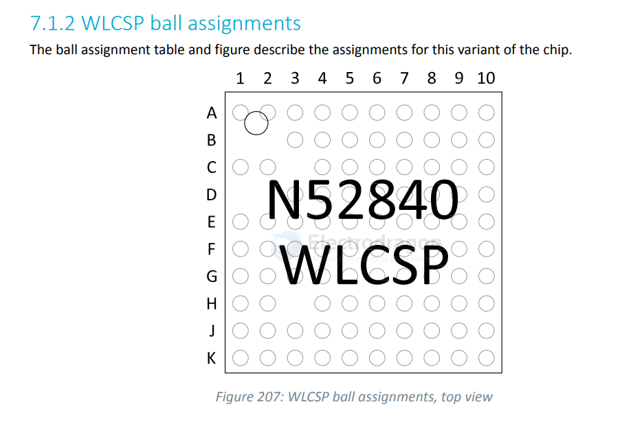
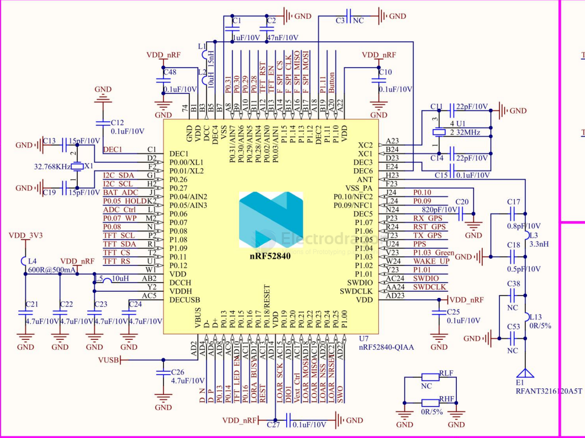
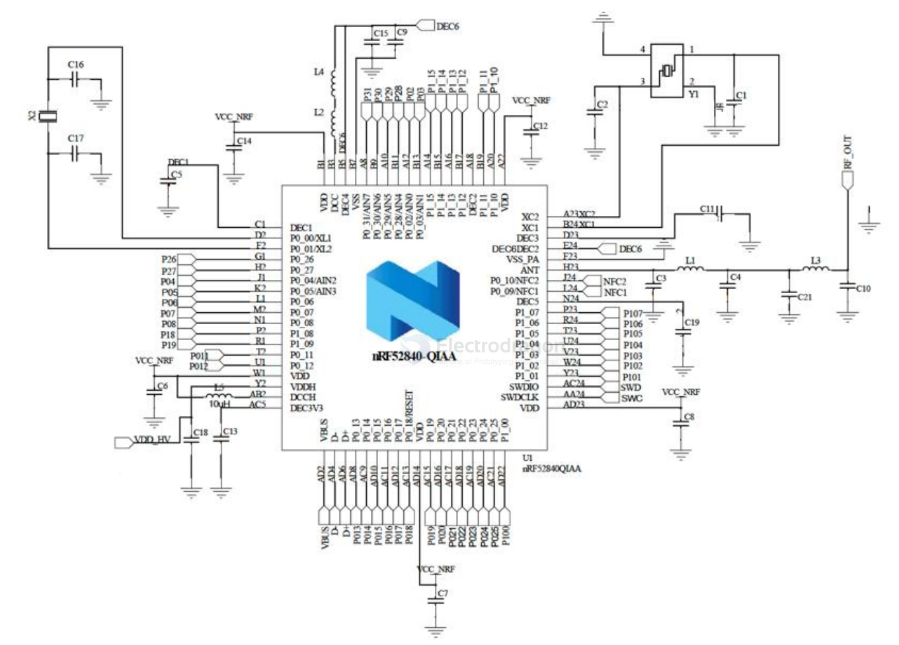
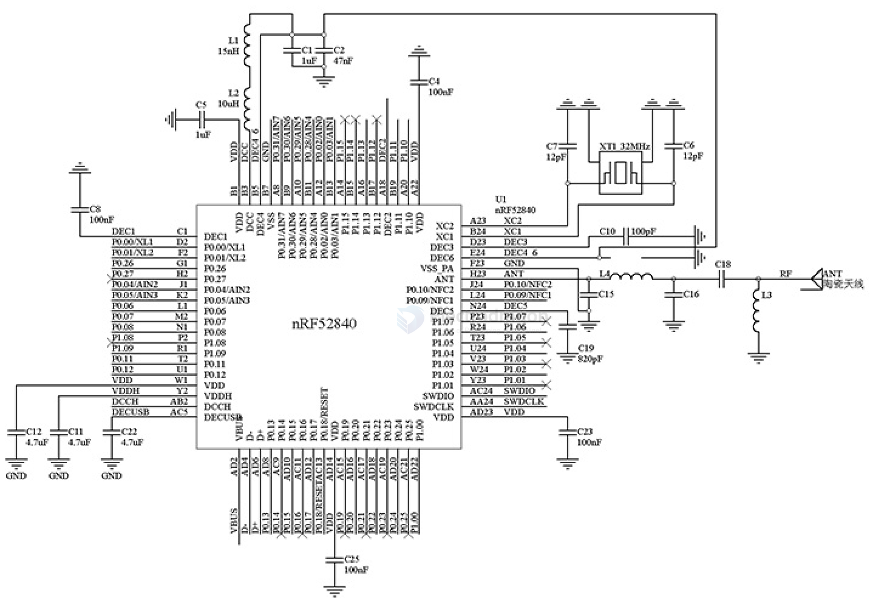

# NRF52840-dat

- [[u-blox-dat]]

- [[NRF5x-dat]] - [[NRF5x-SDK-dat]] - [[NRF52832-dat]] - [[NRF52840-dat]]

- [[NRF52840-mod-dat]] - [[NRF52840-board-1-dat]] - [[arduino-nano-33-ble-dat]] 

- [[NRF5x-dat]] - [[NRF52832-dat]] - [[NRF52840-dat]] - [[nordic-dat]]

nRF52840是一款高性能、低功耗的无线SoC芯片，由挪威Nordic Semiconductor公司推出。它支持多种无线协议，包括Bluetooth 5、Thread、Zigbee、ANT和2.4GHz。nRF52840芯片采用ARM Cortex-M4F处理器，主频为64MHz，内置1MB的闪存和256KB的RAM。它还具有多种外设，包括ADC、PWM、SPI、I2C、UART、USB和GPIO等。此外，nRF52840还支持多种安全功能，如AES加密、SHA-256哈希和True Random Number Generator（TRNG）等。

| Feature                     | nRF52805 | nRF52810 | nRF52811 | nRF52820 | nRF52832 | nRF52833 | nRF52840 | nRF5340 |
| --------------------------- | :------: | :------: | :------: | :------: | :------: | :------: | :------: | :-----: |
| Bluetooth 5.3               |    X     |    X     |    X     |    X     |    X     |    X     |    X     |    X    |
| Bluetooth 2 Mbps            |    X     |    X     |    X     |    X     |    X     |    X     |    X     |    X    |
| Bluetooth Long Range        |          |          |    X     |    X     |          |    x     |    x     |    x    |
| Bluetooth Direction Finding |          |          |    X     |    X     |          |    X     |          |    x    |
| Bluetooth LE Audio          |          |          |          |          |          |          |          |    X    |
| Bluetooth mesh              |          |          |          |    x     |    x     |    x     |    x     |    X    |
| Thread                      |          |          |    X     |    X     |          |    x     |    x     |    X    |
| Zigbee                      |          |          |          |    X     |          |    x     |    x     |    X    |
| Matter                      |          |          |          |          |          |          |    X     |    X    |

## nRF52840 Features

- 32-bit ARM® Cortex®-M4F processor, 64 MHz
- 1 MB Flash, 256 KB RAM
- Bluetooth 5, Bluetooth mesh, Thread, Zigbee, 802.15.4, ANT, proprietary 2.4 GHz
- USB 2.0 full-speed (12 Mbps) device
- NFC-A tag support
- 48 programmable GPIOs
- SPI, I2C, UART, PWM, PDM, I2S, QSPI, and more
- 12-bit ADC, comparator, temperature sensor
- Crypto: AES, ECB, CCM, AAR, RNG, SHA-256
- On-chip DC-DC and LDO regulators
- Supply voltage: 1.7 V to 3.6 V
- Operating temperature: -40°C to +85°C
- Package: QFN73, 7x7 mm
- Arm TrustZone CryptoCell-310 security
- Flexible power management and low power consumption
- Direct Memory Access (DMA)
- Programmable Peripheral Interconnect (PPI)
- EasyDMA for peripherals
- 8/9/10/11/12-bit ADC, 200 ksps
- 4x 32-bit timers, RTC, watchdog, and more

The nRF52840 is quite generous with its I/O compared to many other Bluetooth SoCs. It features a total of 48 GPIO pins.

These pins are organized into two separate "ports":

- Port 0 (P0): Consists of 32 pins (P0.00 to P0.31).
- Port 1 (P1): Consists of 16 pins (P1.00 to P1.15).

## SDK 

- [[CONN-USB-dat]] - [[USB-dat]]

## drive 

- [[LCD-dat]]

## Pin Definitions 

- [[NRF5x-HDK-dat]]

## NRF52840 Pinout Table

| Pin Name | Default Func | Alt Func       | Notes              |
| -------- | ------------ | -------------- | ------------------ |
| P0.00    | GPIO         | *XL1, ADC, NFC |                    |
| P0.01    | GPIO         | *XL2, ADC, NFC |                    |
| P0.02    | GPIO         | ADC, NFC       |                    |
| P0.03    | GPIO         | ADC, NFC       |                    |
| P0.04    | GPIO         | ADC, NFC       |                    |
| P0.05    | GPIO         | ADC, NFC       |                    |
| P0.06    | GPIO         | ADC, NFC       |                    |
| P0.07    | GPIO         | ADC, NFC       |                    |
| P0.08    | GPIO         |                |                    |
| P0.09    | GPIO         | NFC1           | NFC antenna option |
| P0.10    | GPIO         | NFC2           | NFC antenna option |
| P0.11    | GPIO         |                |                    |
| P0.12    | GPIO         |                |                    |
| P0.13    | GPIO         |                |                    |
| P0.14    | GPIO         |                |                    |
| P0.15    | GPIO         |                |                    |
| P0.16    | GPIO         |                |                    |
| P0.17    | GPIO         |                |                    |
| P0.18    | RESET        | GPIO           | REST pin           |
| P0.19    | GPIO         |                |                    |
| P0.20    | GPIO         |                |                    |
| P0.21    | GPIO         |                |                    |
| P0.22    | GPIO         |                |                    |
| P0.23    | GPIO         |                |                    |
| P0.24    | GPIO         |                |                    |
| P0.25    | GPIO         |                |                    |
| P0.26    | GPIO         |                |                    |
| P0.27    | GPIO         |                |                    |
| P0.28    | GPIO         | ADC AIN4       |                    |
| P0.29    | GPIO         | ADC AIN5       |                    |
| P0.30    | GPIO         | ADC AIN6       |                    |
| P0.31    | GPIO         | ADC AIN7       |                    |
| P1.00    | GPIO         |                |                    |
| P1.01    | GPIO         |                |                    |
| P1.02    | GPIO         |                |                    |
| P1.03    | GPIO         |                |                    |
| P1.04    | GPIO         |                |                    |
| P1.05    | GPIO         |                |                    |
| P1.06    | GPIO         |                |                    |
| P1.07    | GPIO         |                |                    |
| P1.08    | GPIO         |                |                    |
| P1.09    | GPIO         |                |                    |
| P1.10    | GPIO         |                | Button             |
| P1.11    | GPIO         |                |                    |
| P1.12    | GPIO         |                |                    |
| P1.13    | GPIO         |                |                    |
| P1.14    | GPIO         |                |                    |
| P1.15    | GPIO         |                |                    |

The nRF52840 has two TWI (Two-Wire Interface/I2C) master instances: TWIM0 and TWIM1. You can configure them to use any pins through the Pin Selection Registers (PSEL). - [[I2C-dat]]

If you are using a development board, the software libraries (like Arduino or Zephyr) usually default to these:

nRF52840 Development Kit (PCA10056):

- SDA: P0.26
- SCL: P0.27

Adafruit Feather nRF52840:

- SDA: P0.25 (Physical Pin 25)
- SCL: P0.26 (Physical Pin 26)

external QSPI flash 

- [[flash-dat]]

- QSPI DATA0  -- PO.17
- QSPI SCK -- P0.19 
- QSPI DATA3  -- PO.21
- QSPI CS -- PO.20
- QSPI DATA2 -- P0.23
- QSPI DATA1 -- PO.22

peripherals  - [[peripherals-dat]]

- Switch P1.02 BUTTON
- Reset  P0.18 BUTTON

- LED1 P1.15 
- LED2 P1.10 
- WS2812  P0.16 
  
- VDIV P0.29 

- SCK  P0.14 
- MOSI P0.13 
- MISO P0.15 

- SWO P1.00

- RXD P0.24
- TXD P0.25

- P0.09 NF1
- P0.10 NF2

- P0.11 SCL
- P0.12 SDA 
- P0.09 NFC / P0.10 NFC

## solutions and apps

- [[NRF52840+SX1262-dat]] - [[lora-dat]] - [[bluetooth-dat]]

- [[head-track-dat]] - [[head-track]]

## NRF52840 SCH 

### SCH1 

- button == P1.10 
- REST == P0.18/RESET 

- I2C == P0.26 / P0.27 
- BAT_ADC == P0.04
- SPI == P1.12 ~ P1.15 

### SCH2 Module 

### SCH3 module 

- [[ebyte-dat]]

## datasheet 

## ref 

- [[bluetooth-dat]] - [[nrf52840]]

- [[nordic-dat]]

- [[flash-dat]]

- [[protection-dat]] - [[capacitor-dat]]

- [[rf-star-dat]]