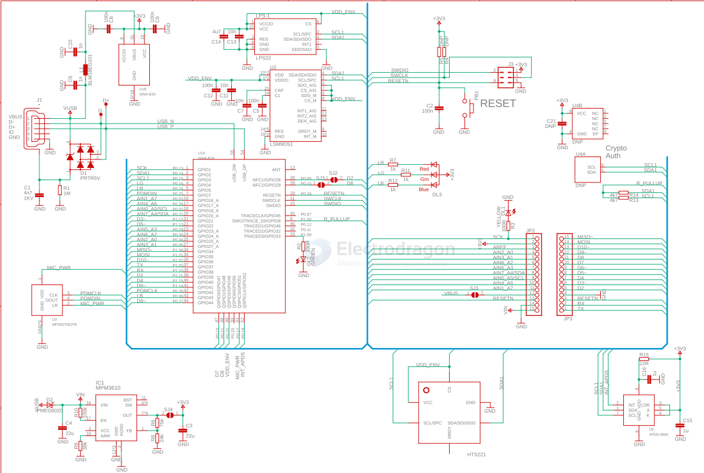

# arduino-nano-33-ble-dat

https://store.arduino.cc/products/arduino-nano-33-ble

- [[arduino-nano-33-ble-dat]] - [[arduino-boards-dat]]

## SCH 

- [[HTS221-dat]] - [[sensor-temp-hum-dat]] - [[sensor-dat]]

- [[MPM3610-dat]] - [[dcdc-down-dat]] - [[MPS-dat]]

- [[MP34DT06JTR-dat]] - [[sensor-microphone-dat]] - [[st-sensor-dat]] - [[sensor-microphone-I2S]]

- [[ESD-dat]] - [[USB-ESD-dat]]

- [[NRF52840-dat]] 

NINA-B3 - [[u-blox-dat]] - u-blox NINA-B3 Stand-Alone Bluetooth 5 Low Energy Modules

- [[LSM9DS1-dat]] - [[9-axis-imu-dat]]

- LPS22 - [[sensor-pressure-dat]]

- [[APDS-9960-dat]]

## ref 

- [[arduino-nano-33-ble-dat]] - [[arduino-boards-dat]]

