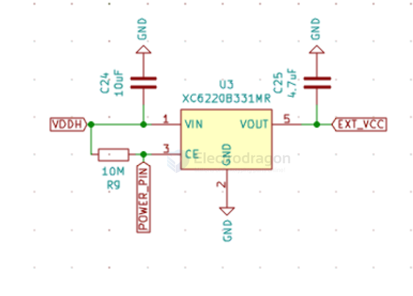
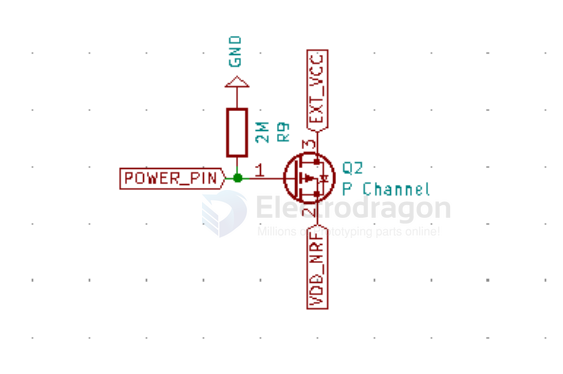

# NRF5x-HDK-dat.md

- [[jlink-dat]]

- [[battery-charger-dat]] - [[BT24075-dat]] - [[TI-power-dat]]

## P0.13 power control 

[[LDO-dat]] en control 

[[mosfet-dat]] control 

## ref 

- [[NRF5x-HDK-dat]] - [[NRF52840-board-1-dat]] - [[NRF52840-dat]]

- [[NRF5x-SDK-dat]]

- [[NRF5x-dat]] - [[NRF5x]] - [[nordic]]