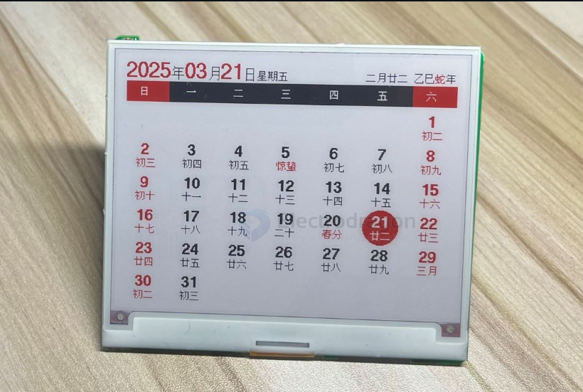

# NRF5x-dat

- [[NRF52810-dat]] - [[NRF51822-dat]] - [[NRF52832-dat]] - [[NRF52840-dat]]

- [[ARM-dat]]

- [[NRF5x-dat]] - [[NRF52832-dat]] - [[NRF52840-dat]]

## APPs 

### epaper driver code 

The e-paper firmware comes with a web-based host application. You can transfer images to the e-paper display via Bluetooth, or set the display to calendar mode (supports lunar calendar, solar terms, and holiday schedule adjustments).

Supported main control chips: nrf51822 / nrf51802 / nrf52811 / nrf52810

Supported e-paper drivers: UC8176 / UC8276 / SSD1619 / SSD1683 / JD79668 (black & white / three-color / four-color e-paper displays)

Also supports custom mapping of e-paper display pins to the MCU, sleep/wake (NFC / wireless charger), and Bluetooth OTA firmware

original code - https://github.com/tsl0922/EPD-nRF5

folk version - https://github.com/Edragon/EPD-nRF5

## ref 

- [[nordic-dat]]